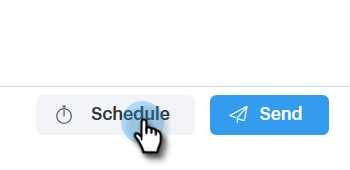

# Planification d’un courrier électronique {#scheduling-an-email}

Suivez ces étapes simples pour planifier un courriel.

>[!NOTE]
>
>Pour mettre à jour votre fuseau horaire par défaut, accédez à la page Paramètres.

1. Créez votre brouillon de courrier électronique (il existe plusieurs façons de procéder, dans cet exemple, nous choisissons **Composer** dans l&#39;en-tête).

   

1. Lorsque vous avez terminé de rédiger votre courrier électronique, cliquez sur **Planifier** en bas à droite.

   

1. Cliquez sur la date pour ouvrir le sélecteur de date et sélectionner une date.

   

1. Entrez l&#39;heure à laquelle vous souhaitez que le courrier électronique soit envoyé. Sélectionnez le fuseau horaire de votre choix, puis cliquez sur **Enregistrer**. Fermez le Planificateur lorsque vous avez terminé.

   

1. Maintenant que la date/l’heure planifiée est sélectionnée, cliquez sur **Envoyer** pour planifier le courrier électronique.

   

   >[!NOTE]
   >
   >Les messages électroniques planifiés peuvent être affichés/modifiés dans la section Dossiers planifiés du Centre de commandes.

   >[!NOTE]
   >
   >**Articles connexes**
   >
   >
   >[Présentation du centre de commandes](http://docs.marketo.com/x/kgDb)

