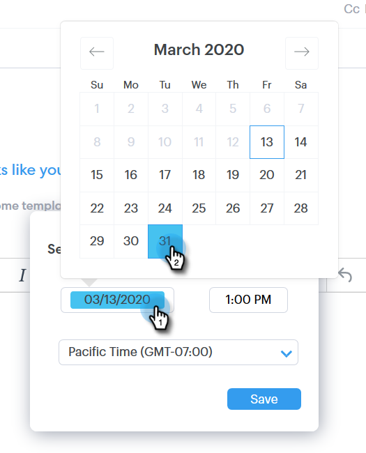
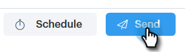

# Planification d’un e-mail {#scheduling-an-email}

Pour planifier l’envoi d’un e-mail, procédez comme suit.

>[!NOTE]
>
>Pour mettre à jour votre fuseau horaire par défaut, accédez à la page Paramètres .

1. Créez votre brouillon d’e-mail (il existe plusieurs façons de le faire, dans cet exemple nous choisissons **[!UICONTROL Composer]** dans l’en-tête).

   

1. Une fois la composition de votre e-mail terminée, cliquez sur **[!UICONTROL Planifier]** en bas à droite

   

1. Cliquez sur la date pour ouvrir le sélecteur de date et sélectionner une date.

   

1. Entrez l’heure à laquelle vous souhaitez que l’e-mail soit envoyé. Sélectionnez le fuseau horaire souhaité, puis cliquez sur **[!UICONTROL Enregistrer]**. Fermez le planificateur lorsque vous avez terminé.

   

1. Maintenant que la date/l’heure planifiée est sélectionnée, cliquez sur **[!UICONTROL Envoyer]** pour planifier l’e-mail.

   

   >[!NOTE]
   >
   >Les e-mails planifiés peuvent être consultés/modifiés dans la section des dossiers planifiés du Centre de commandes.

   >[!MORELIKETHIS]
   >
   >[Présentation du centre de commande](/help/marketo/product-docs/marketo-sales-connect/email/command-center/command-center-overview.md)
