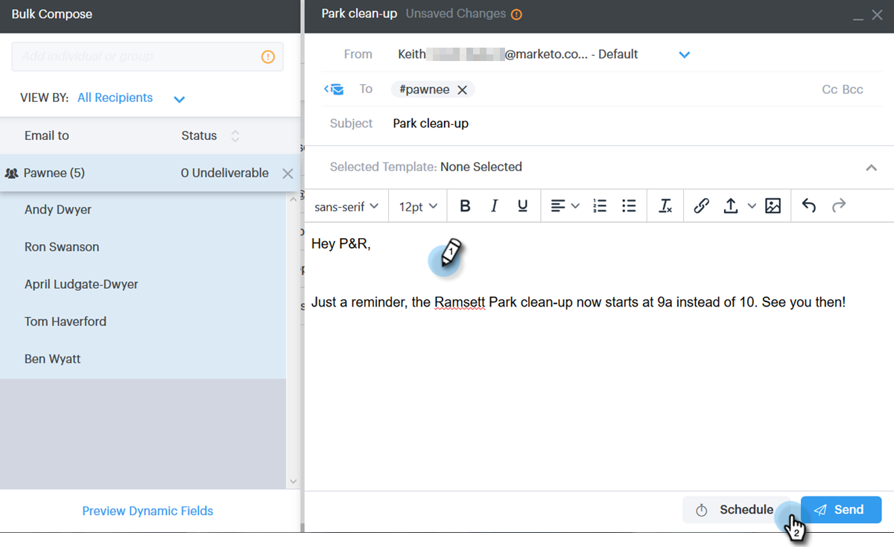
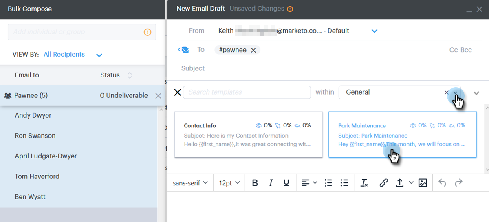

# Envoi d’emails par courrier électronique de groupe {#sending-emails-via-group-email}

Voici comment envoyer/modifier des emails à l’aide de l’option Courrier électronique de groupe .

## Envoi d’un e-mail de groupe {#sending-a-group-email}

1. Cliquez sur l’onglet **Personnes** .

   

1. Sélectionnez le groupe que vous souhaitez envoyer par courrier électronique.

   

1. Cliquez sur le bouton Actions de groupe et sélectionnez **Groupe d’emails**.

   

1. Remplissez votre email (ou sélectionnez un modèle) et envoyez-le (ou planifiez).

   

## Modification d’un email de groupe {#editing-a-group-email}

1. Créez un email de groupe à l’aide des [étapes 1 à 3 ci-dessus](#sending-a-group-email).

1. Choisissez un modèle ou renseignez votre email.

   

1. Une fois l’email terminé, vous pouvez maintenant prévisualiser chaque email de la liste pour vérifier si les champs dynamiques sont correctement renseignés.

   

1. Sélectionnez un destinataire.

   

1. Cliquez sur **Aperçu des champs dynamiques** et affichez l’aperçu à droite.

   

   >[!NOTE]
   >
   >Vous pouvez apporter des modifications en masse à l’email/au modèle lors de l’envoi d’un email de groupe, mais vous ne pouvez pas apporter de modifications uniques à des destinataires spécifiques de la liste.

>[!MORELIKETHIS]
>
>* [Options d’envoi en masse](/help/marketo/product-docs/marketo-sales-connect/email/using-the-compose-window/bulk-sending-options.md)
>* [Utilisation d’un modèle dans la fenêtre de composition](/help/marketo/product-docs/marketo-sales-connect/email/using-the-compose-window/using-a-template-in-the-compose-window.md)
