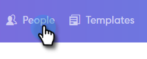

# Envoi de courriers électroniques par courriel de groupe {#sending-emails-via-group-email}

Voici comment envoyer/modifier des courriers électroniques à l’aide de l’option Courriel de groupe.

## Envoi d’un courriel de groupe {#sending-a-group-email}

1. Cliquez sur l’onglet **Personnes** .

   

1. Sélectionnez le groupe que vous souhaitez envoyer par courriel.

   

1. Cliquez sur le bouton Actions de groupe et sélectionnez Groupe **de** messagerie.

   

1. Remplissez votre e-mail (ou sélectionnez un modèle) et envoyez-le (ou planifiez).

   

## Modification d&#39;un courriel de groupe {#editing-a-group-email}

1. Créez un courriel de groupe à l’aide des [étapes 1 à 3 ci-dessus](https://docs.marketo.com/display/DOCS/Sending+Emails+via+Group+Email#SendingEmailsviaGroupEmail-SendingaGroupEmail).
1. Choisissez un modèle ou complétez votre adresse électronique.

   

1. Une fois le courrier électronique terminé, vous pouvez désormais prévisualisation chaque courrier électronique dans la liste afin de vérifier si les champs dynamiques sont renseignés correctement.

   

1. Sélectionnez un destinataire.

   

1. Cliquez sur Champs **dynamiques de** Prévisualisation et vue de la prévisualisation sur la droite.

   

   >[!NOTE]
   >
   >Vous pouvez apporter des modifications en masse au courrier électronique ou au modèle lors de l’envoi d’un courrier électronique de groupe, mais vous ne pouvez pas apporter de modifications uniques à des destinataires spécifiques de la liste.

>[!NOTE]
>
>**Articles connexes**
>
>* [Options d&#39;envoi en masse](http://docs.marketo.com/x/HwQ6Ag)
>* [Utilisation d’un modèle dans la fenêtre Composer](http://docs.marketo.com/x/MQQ6Ag)
>* [Champs dynamiques](http://docs.marketo.com/x/wwDb)

>

