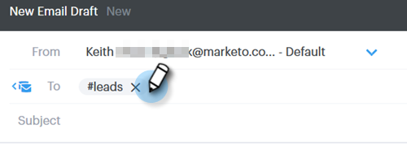

# Utilisation d’un modèle dans la fenêtre Composer {#using-a-template-in-the-compose-window}

## Recherche et utilisation de modèles {#finding-and-using-templates}

1. Créez votre brouillon de courrier électronique (il existe plusieurs façons de procéder, dans cet exemple, nous choisissons **Composer** dans l&#39;en-tête).

   

1. Renseignez le champ A.

   

1. Cliquez sur l’icône de recherche dans la section Modèle pour ouvrir le champ de recherche de modèle.

   

1. Sélectionnez une catégorie dans laquelle effectuer la recherche (ou sélectionnez Toutes pour effectuer la recherche sur toutes les catégories).

   

1. Effectuez une recherche par nom de modèle, par objet ou par corps du courrier électronique. Cliquez sur le modèle de votre choix pour le sélectionner.

   

   >[!NOTE]
   >
   >La sélection d’un autre modèle remplace toutes les informations actuellement dans l’éditeur. Si vous apportez des modifications, veillez à les copier avant de sélectionner un autre modèle.

## Epinglage de Catégories de modèle dans la fenêtre Composer {#pinning-template-categories-in-the-compose-window}

Utilisez **jusqu’à cinq** catégories de modèles spécifiques pour accéder rapidement à vos modèles les plus utilisés.

1. Créez votre brouillon de courrier électronique (il existe plusieurs façons de procéder, dans cet exemple, nous choisissons **Composer** dans l&#39;en-tête).

   

1. Cliquez sur l’icône **+** en regard de Favoris.

   

1. Cliquez sur la liste déroulante **Epingler une Catégorie** et sélectionnez la catégorie de votre choix.

   

1. Cliquez sur **Enregistrer les modifications** une fois terminé (facultatif) : répétez l’étape 3 pour en ajouter d’autres).

   

   >[!TIP]
   >
   >Vous pouvez réorganiser vos catégories épinglées simplement en les faisant glisser et en les déposant avant d’enregistrer vos modifications.

   

   >[!NOTE]
   >
   >**Par défaut, les Favoris** y figurent. Il contient les modèles de courrier électronique favoris, pas les catégories.

   >[!NOTE]
   >
   >**Articles connexes**
   >
   >    
   >    
   >    * [Champs dynamiques](http://docs.marketo.com/x/wwDb)
   >    * [Utilisation de modèles](http://docs.marketo.com/display/DOCS/Templates)

La catégorie sélectionnée est maintenant épinglée.