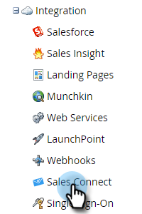

# Accès à votre nouvelle instance Sales Connect {#accessing-your-new-sales-connect-instance}

>[!NOTE]
>
>**Autorisations d’administrateur requises.**

Une fois Sales Connect acheté, une nouvelle page d’intégration s’affiche dans votre instance Marketo. Utilisez cette page pour inviter votre premier utilisateur et configurer son instance Sales Connect.

1. Dans Marketo, cliquez sur **[!UICONTROL Admin]**.

   

1. Cliquez sur **[!UICONTROL Connexion vente]**.

   

1. Dans une liste d’administrateurs Marketo à inviter, sélectionnez-en un, puis cliquez sur **[!UICONTROL Envoyer l’invitation]**.

   

L’utilisateur recevra un courrier électronique contenant les étapes à suivre pour accéder au compte Sales Connect.

>[!NOTE]
>
>Les utilisateurs supplémentaires ne seront **pas** ajoutés via Marketo, mais via la page Gestion des utilisateurs de Sales Connect. [Cliquez ici](/help/marketo/product-docs/marketo-sales-connect/admin/invite-users.md) pour en savoir plus sur l’ajout d’utilisateurs supplémentaires.
