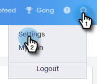

# Modifier votre mot de passe Sales Connect {#change-your-sales-connect-password}

Vous souhaitez modifier votre mot de passe ? Voici comment faire.

## Modifier Votre Mot De Passe Lors De La Connexion {#change-your-password-while-signed-in}

1. Cliquez sur l’icône d’engrenage et sélectionnez **[!UICONTROL Paramètres]**.

   

1. Votre page [!UICONTROL Mon profil] s’ouvre par défaut. Sous [!UICONTROL Détails du compte], cochez la case **[!UICONTROL Modifier le mot de passe]**.

   

1. Entrez votre mot de passe actuel. Saisissez ensuite le nouveau champ, puis saisissez-le à nouveau en veillant à ce qu’il corresponde. Cliquez sur **[!UICONTROL Enregistrer]** lorsque vous avez terminé.

   

>[!NOTE]
>
>Les mots de passe doivent :
>
>* Contiennent au moins neuf caractères
>* Utiliser des majuscules et des minuscules (en haut et en bas)
>* Inclure un nombre
>* Utiliser un caractère spécial

## Modifier Votre Mot De Passe Lors De La Déconnexion {#change-your-password-while-signed-out}

1. Accédez à la page [Connexion à Sales Connect](https://toutapp.com/login) et cliquez sur **[!UICONTROL Mot de passe oublié ?]**.

   

1. Saisissez l’adresse e-mail associée au compte et cliquez sur **[!UICONTROL Envoyer un e-mail de réinitialisation]**.

   

1. Nous enverrons un e-mail pour vérifier que le propriétaire du compte souhaite modifier le mot de passe. Cliquez sur **[!UICONTROL Réinitialiser le mot de passe]**.

   

   >[!NOTE]
   >
   >Veillez également à vérifier votre dossier Spam, car cet e-mail peut parfois y aboutir.

1. Saisissez et confirmez votre nouveau mot de passe. Cliquez sur **[!UICONTROL Définir le mot de passe]** lorsque vous avez terminé.

   
