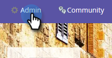

# Prise en main de Sales Connect {#getting-started-with-sales-connect}

Si vous préférez regarder ces étapes plutôt que de les lire, passez directement aux [Instructions vidéo ci-dessous](#video).

>[!NOTE]
>
>**Disponibilité**
>
>Tous les clients n’ont pas acheté cette fonctionnalité. Pour plus d’informations, contactez votre responsable de succès client.

## Ce dont vous avez besoin pour commencer {#what-you-need-to-get-started}

* Abonnement du marketing
* Abonnement de connexion commerciale
* Abonnement Salesforce (avec les appels d’API et les classes Apex activés)

## Qui commencer {#who-you-need-to-get-started}

* Utilisateur administrateur du marketing
* Utilisateur administrateur de Sales Connect
* Admin Salesforce
* Utilisateurs de Sales Connect

## Administrateurs de Sales Connect {#sales-connect-admins}

Vous recevrez un courriel de Marketo contenant un lien pour réinitialiser votre mot de passe. Après avoir créé un nouveau mot de passe, connectez-vous à Sales Connect.

Pour terminer la configuration, vous devez effectuer les opérations suivantes :

* [Connecter Sales Connect et Salesforce](#sfdc)
* [Acquérir des informations d&#39;identification avant de connecter les ventes à Marketing](#acquire)
* [Connexion des ventes à Marketing](#mkto)
* [Invitation/Configuration d’utilisateurs](#IPU)

Vous pouvez également :

* [Tester Sales Connect dans votre sandbox](#sandbox)

## Connecter votre compte de connexion commerciale à Salesforce {#connect-your-sales-connect-account-to-salesforce}

Pour connecter votre compte Sales Connect à votre compte Salesforce, en tant qu&#39;administrateur ou non, suivez les étapes décrites dans [cet article](http://docs.marketo.com/x/JwDb).

>[!NOTE]
>
>L&#39;instance de Salesforce à laquelle vous vous connectez doit être la même instance que celle qui est (ou sera) connectée à Marketo.

## Obtention d&#39;informations d&#39;identification avant la connexion des ventes à Marketo {#acquiring-credentials-prior-to-connecting-sales-connect-with-marketo}

Vous devrez obtenir un jeu d’informations d’identification à partir de Marketing Cloud. Ces informations d&#39;identification seront utilisées ultérieurement par l&#39;administrateur de Sales Connect pour connecter Marketing à Sales Connect.

1. Dans Marketo, cliquez sur **Admin**.

   

1. Dans l&#39;arborescence, cliquez sur **Connexion commerciale**.

   

1. Sélectionnez et envoyez les informations d’identification Marketing Cloud suivantes à votre administrateur Sales Connect : Munchkin ID, Client ID, Client Secret.

   

   >[!NOTE]
   >
   >Lorsque vous copiez et collez les informations ci-dessus, assurez-vous qu’aucun espace n’est ajouté.

## Connecter la connexion commerciale au marketing {#connect-sales-connect-to-marketo}

1. Dans Sales Connect, cliquez sur l&#39;icône représentant un engrenage et sélectionnez **Paramètres**.

   

1. Sous Paramètres d’administration, sélectionnez **Marketo**.

   

1. Saisissez les informations d’identification de Marketo fournies par l’administrateur de Marketo et cliquez sur **Se connecter**.

   

## Invitation/Configuration d’utilisateurs {#invite-provision-users}

Si des utilisateurs existent déjà sur votre compte (précédemment de ToutApp), ils s’afficheront dans l’onglet **Accès de l’équipe** de la section Marketo de Sales Connect.

Vous pouvez configurer votre équipe en tant qu&#39;utilisateur Marketing Connect Sales Connect à partir de cette page. Si vous n&#39;avez jamais utilisé ToutApp ou n&#39;avez pas encore invité d&#39;utilisateurs, suivez les étapes décrites dans [cet article](http://docs.marketo.com/display/TOUT/Invite+Team+Members).

>[!CAUTION]
>
>Veuillez patienter dix minutes après la connexion de Sales Connect avec Marketo avant d&#39;effectuer ces étapes.

1. Sélectionnez un ou plusieurs utilisateurs, puis cliquez sur **Se connecter**.

   >[!NOTE]
   >
   >Vous ne pouvez affecter l’espace de travail qu’une seule fois au moment d’inviter des utilisateurs. Une fois défini, vous devrez déconnecter l&#39;utilisateur pour le modifier.

   

1. Si les espaces de travail sont activés dans votre abonnement de marketing, vous pourrez les affecter à chaque utilisateur ou à un ensemble d’utilisateurs en bloc. Si aucun espace de travail n&#39;est sélectionné, nous l&#39;affecterons à l&#39;espace de travail Marqueur par défaut.

   

1. Cliquez sur la liste déroulante Espace de travail, sélectionnez le ou les espaces de travail de votre choix, puis cliquez sur **Se connecter**.

   

   >[!NOTE]
   >
   >Si vous souhaitez ajouter de nouveaux utilisateurs, accédez à la section Gestion d’équipe des Paramètres d’administration et cliquez sur le bouton **Inviter des utilisateurs**.

Vous pouvez ajouter d’autres utilisateurs à la page Gestion d’équipe et suivre les étapes ci-dessus pour les connecter.

## Testez Sales Connect dans votre sandbox {#test-sales-connect-in-your-sandbox}

Pour les équipes qui souhaitent tester Marketing Connect Sales Connect avec leur sandbox Marketo, un compte Sales Connect supplémentaire peut être mis en service sur demande. Il s’agit uniquement pour les clients qui ont acheté un sandbox Marketo, ou pour ceux qui l’ont dans le cadre de leur offre groupée Marketo. Si vous souhaitez acquérir un sandbox, contactez votre gestionnaire de compte Marketo.

>[!NOTE]
>
>Vous ne pouvez pas configurer un compte Sales Connect avec le même ID d&#39;adresse électronique pour plusieurs instances. En d&#39;autres termes, si vous souhaitez disposer d&#39;un compte Sales Connect supplémentaire à tester avec votre instance Marketo Sandbox, vous devez utiliser un ID de courrier électronique différent dans chacun des comptes.

## Instructions vidéo {#video-instructions}

`<iframe width="630" height="470" src="//play.vidyard.com/w5RY7iMPpEfUYQ4Fp8WUKR.html?v=3.1.1" frameborder="0" allowfullscreen></iframe>`
