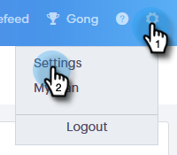
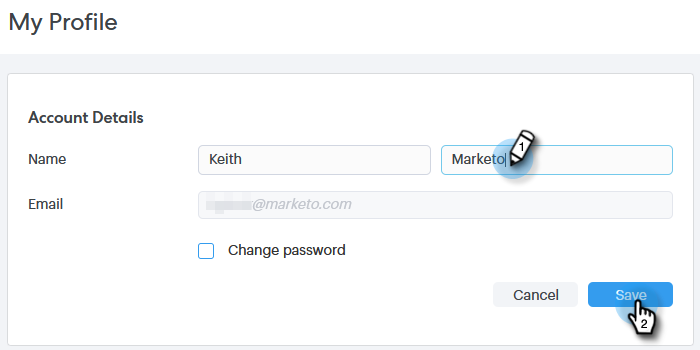
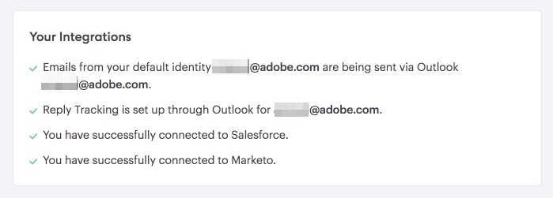
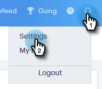
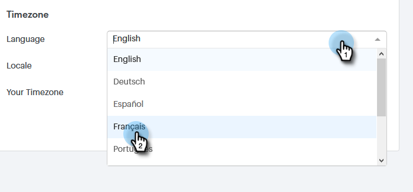
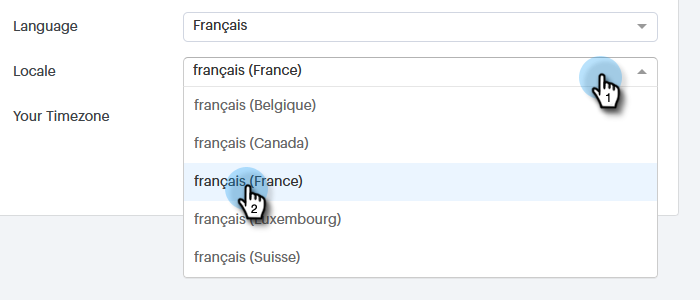
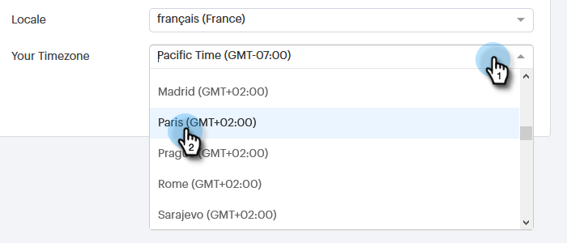
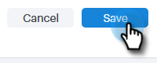

# Gérer votre profil {#manage-your-profile}

Sur votre page [!UICONTROL Mon profil], vous pouvez mettre à jour votre nom, la langue/le paramètre régional/le fuseau horaire de votre compte et également modifier votre mot de passe.

## Détails du compte {#account-details}

Voici où vous pouvez mettre à jour votre nom et/ou votre mot de passe.

1. Cliquez sur l’icône d’engrenage et sélectionnez **[!UICONTROL Paramètres]**.

   

1. Votre page Mon profil s’ouvre par défaut. Pour mettre à jour votre nom, saisissez simplement les modifications, puis cliquez sur **[!UICONTROL Enregistrer]**.

   

>[!NOTE]
>
>Votre adresse e-mail est définie pour affichage uniquement. Si vous avez besoin de modifier ce paramètre, contactez l’assistance technique de [&#128279;](https://nation.marketo.com/t5/Support/ct-p/Support).

Vous pouvez également modifier votre mot de passe dans cette section. Les étapes sont décrites dans ce document.

## Vos intégrations {#your-integrations}

Sur le côté droit de la page, la section [!UICONTROL Vos intégrations] fournit le statut de toutes les connexions de votre compte.

>[!NOTE]
>
>Si vous utilisez Exchange On Prem avec Sales Connect, les contrôles de l’intégrité de l’intégration du canal de diffusion (1re ligne) ou du suivi des réponses (2e ligne) ne seront pas mis à jour. Nous nous efforçons de prendre en charge cette fonctionnalité dans une version ultérieure.

## Fuseau horaire {#time-zone}

Voici comment modifier la langue, les paramètres régionaux et/ou le fuseau horaire de votre compte.

>[!NOTE]
>
>Langues prises en charge : anglais, français, allemand, japonais, portugais, espagnol.

1. Cliquez sur l’icône d’engrenage et sélectionnez **[!UICONTROL Paramètres]**.

   

1. Pour modifier la langue, cliquez sur le menu déroulant **[!UICONTROL Langue]** et effectuez votre choix.

   

1. Le paramètre régional fait ici référence à la région dans laquelle cette langue est parlée. Cliquez sur le menu déroulant **[!UICONTROL Paramètres régionaux]** et effectuez votre choix.

   

1. Cliquez sur le menu déroulant **[!UICONTROL Votre fuseau horaire]** et effectuez votre choix.

   

1. Cliquez sur **[!UICONTROL Enregistrer]** lorsque vous avez terminé.

   

Et voilà !
