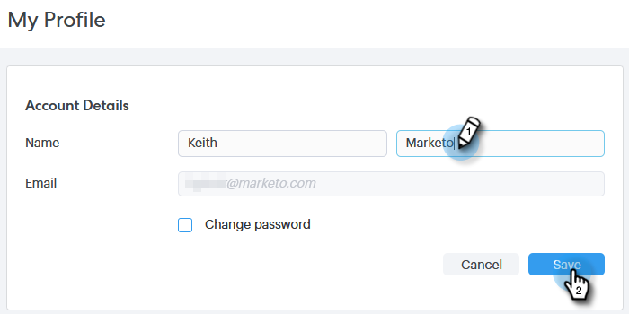

# Ma page de Profil {#my-profile-page}

Dans votre page Mon Profil, vous pouvez mettre à jour votre nom, la langue/les paramètres régionaux/le fuseau horaire de votre compte, ainsi que votre mot de passe.

## Détails du compte {#account-details}

Vous pouvez mettre à jour votre nom et/ou votre mot de passe ici.

1. Cliquez sur l’icône d’engrenage et sélectionnez **Paramètres**.

   

1. Votre page Mon Profil s’ouvre par défaut. Pour mettre à jour votre nom, il vous suffit de saisir les modifications et de cliquer sur **Enregistrer**.

   

>[!NOTE]
>
>Votre adresse électronique est définie sur vue uniquement. Si vous avez besoin d&#39;une modification, contactez le [Support marketing](https://nation.marketo.com/t5/Support/ct-p/Support).

Vous pouvez également modifier votre mot de passe dans cette section. Les étapes sont décrites dans ce document.

## Vos intégrations {#your-integrations}

Sur le côté droit de la page, la section Vos intégrations fournit l’état de toutes les connexions de votre compte.

>[!NOTE]
>
>Si vous utilisez Exchange On Prem avec Sales Connect, il ne mettra pas à jour les contrôles d&#39;intégrité de l&#39;intégration du Canal de Diffusion (1ère ligne) ou du suivi des réponses (2e ligne). Nous travaillons à la prise en charge de ce problème dans une prochaine version.

## Fuseau horaire {#time-zone}

Voici comment modifier la langue, les paramètres régionaux et/ou le fuseau horaire de votre compte.

>[!NOTE]
>
>Langues prises en charge : Allemand, anglais, français, japonais, portugais, espagnol.

1. Cliquez sur l’icône d’engrenage et sélectionnez **Paramètres**.

   

1. Pour modifier votre langue, cliquez sur la liste déroulante **Langue** et faites votre choix.

   

1. La langue ici fait référence à la région dans laquelle cette langue est parlée. Cliquez sur la liste déroulante **Paramètres régionaux** et faites votre choix.

   

1. Cliquez sur la liste déroulante **Votre fuseau horaire** et faites votre choix.

   

1. Cliquez sur **Enregistrer** lorsque vous avez terminé.

   

Et voilà !
