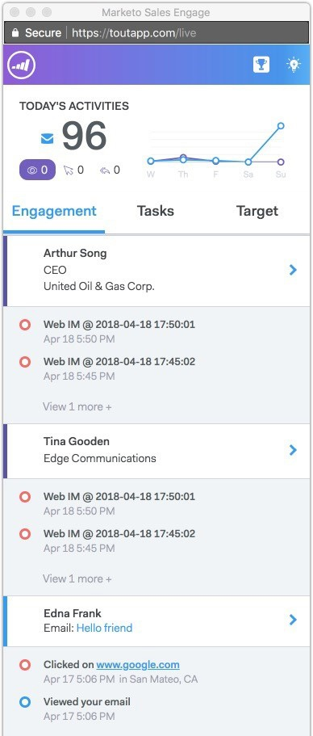
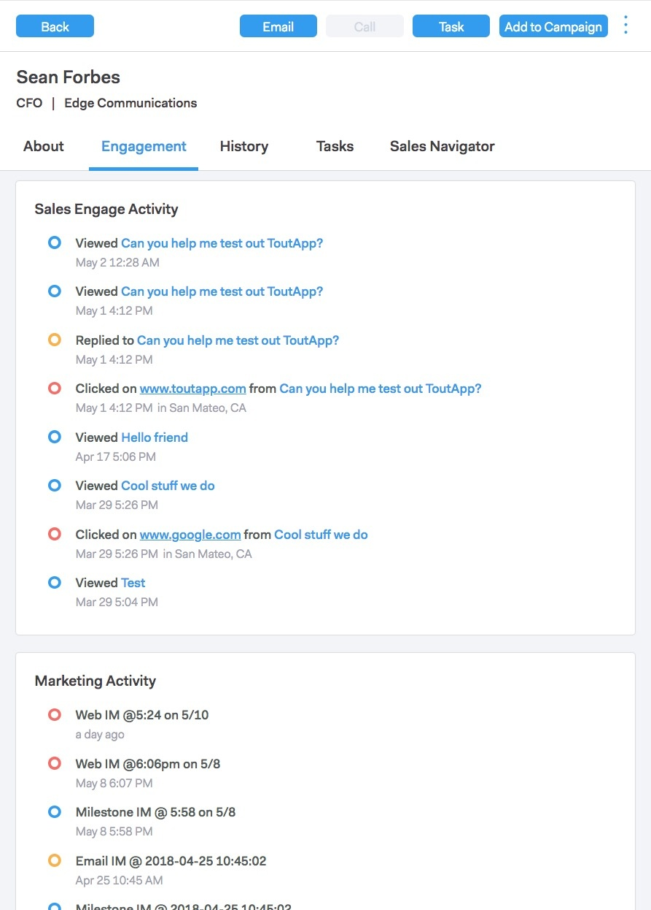
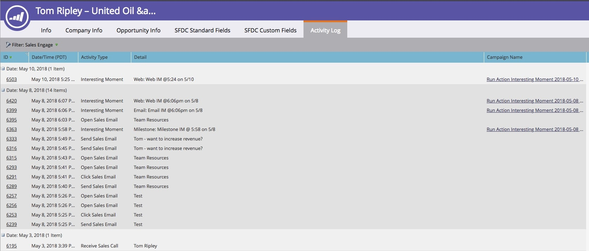
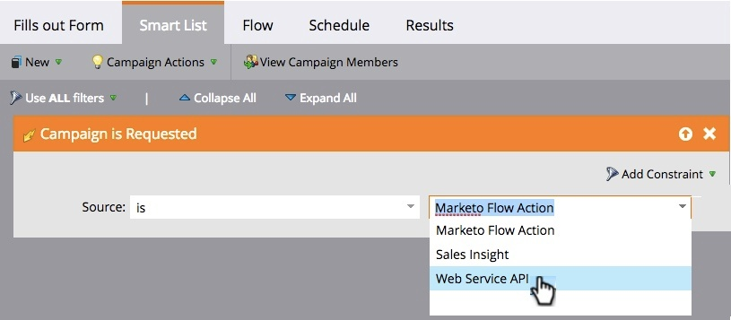

# Vue d’ensemble de Sales Connect {#sales-connect-overview}

Marketo Sales Connect est une solution d’assistance commerciale multidimensionnelle offrant diverses fonctions, qui vous aide à stimuler l’engagement tout au long du cycle de vente.

>[!AVAILABILITY]
>
>Tout le monde n’a pas acheté cette fonctionnalité. Pour plus d’informations, contactez l’équipe du compte Adobe (votre gestionnaire de compte).

## Le flux en direct {#the-live-feed}

Les représentants commerciaux peuvent afficher l[engagement en temps réel](/help/marketo/product-docs/marketo-sales-connect/email/the-live-feed/live-feed-overview.md) du contenu marketing et commercial.

## Vue des détails d’une personne {#person-detail-view}

Accédez [statistiques détaillées sur les personnes](/help/marketo/product-docs/marketo-sales-connect/people/person-detail-view.md).

## Afficher les résultats dans votre journal d’activité Marketo {#see-results-in-your-marketo-activity-log}

Découvrez comment vos prospects participent à vos efforts de vente.

<table>
 <tbody>
  <tr>
   <th>Type d’activité</th>
   <th>Description</th>
  </tr>
  <tr>
   <td>
Envoyer un e-mail de vente
</td>
   <td>
L’utilisateur a envoyé un e-mail de vente à partir de Sales Connect.
</td>
  </tr>
  <tr>
   <td>
Ouvrir l’e-mail commercial
</td>
   <td>
Le prospect a ouvert un e-mail de vente envoyé à partir de Sales Connect.
</td>
  </tr>
  <tr>
   <td>
Cliquer sur l’e-mail commercial
</td>
   <td>
Le prospect a cliqué sur un lien dans un e-mail de vente envoyé à partir de Sales Connect.
</td>
  </tr>
  <tr>
   <td colspan="1">
Recevoir l'e-mail de vente
</td>
   <td colspan="1">
Le prospect a reçu un courrier électronique envoyé par Sales Connect.
</td>
  </tr>
  <tr>
   <td colspan="1">
Recevoir l’appel de vente
</td>
   <td colspan="1">
Le prospect a reçu un appel d’un vendeur à l’aide de l’<a href="/help/marketo/product-docs/marketo-sales-connect/phone/sales-phone-overview.md" rel="nofollow">Téléphone de vente</a>.
</td>
  </tr>
  <tr>
   <td colspan="1">
Ajouter à la campagne de ventes
</td>
   <td colspan="1">
Le prospect a été ajouté à une campagne commerciale créée dans Sales Connect (dans la page Campagnes ).
</td>
  </tr>
  <tr>
   <td colspan="1">
Supprimé De La Campagne De Ventes
</td>
   <td colspan="1">
Le prospect a été supprimé d'une campagne de vente.
</td>
  </tr>
  <tr>
   <td colspan="1">
Moment significatif
</td>
   <td colspan="1">
Lead a eu un moment intéressant généré dans Marketo.
</td>
  </tr>
 </tbody>
</table>

## Partager des campagnes marketing {#share-marketing-campaigns}

Créez une campagne intelligente simple pour donner à vos commerciaux l’accès aux données de la campagne [Marketo](/help/marketo/product-docs/marketo-sales-connect/marketo/make-a-campaign-visible-to-sales-connect-users.md).

Vous êtes prêt à commencer ? Pour obtenir des instructions de configuration, cliquez sur le lien ci-dessous.

>[!MORELIKETHIS]
>
>[Guide de prise en main pour les administrateurs de Sales Connect](/help/marketo/product-docs/marketo-sales-connect/getting-started/getting-started-guide-for-sales-connect-admins.md)
