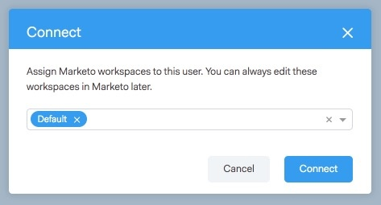

# Octroi d’un accès à des utilisateurs et des utilisatrices {#granting-access-to-users}

Suivez les étapes de cet article pour accorder à vos utilisateurs [!DNL Sales Connect] l’accès à la connexion Marketo. Cela déverrouillera des fonctionnalités telles que les moments significatifs dans le flux en direct et l’accès aux campagnes marketing.

Vous devez inviter les utilisateurs à [!DNL Sales Connect] [ici](/help/marketo/product-docs/marketo-sales-connect/admin/invite-users.md) avant qu’ils ne soient visibles dans la page Marketo > [!UICONTROL Accès des équipes] (en [!DNL Sales Connect]), où l’accès à la connexion Marketo est accordé.

>[!CAUTION]
>
>Patientez dix minutes après la connexion de [!DNL Sales Connect] à Marketo avant d’effectuer ces étapes.

1. Sélectionnez un ou plusieurs utilisateurs, puis cliquez sur **[!UICONTROL Connexion]**.

   >[!NOTE]
   >
   >Vous ne pouvez attribuer l’espace de travail qu’une seule fois au moment d’accorder l’accès aux utilisateurs. Une fois défini, vous devrez déconnecter l’utilisateur ou l’utilisatrice afin de le modifier.

   

1. Si les espaces de travail sont activés pour votre abonnement à Marketo, vous pourrez affecter des espaces de travail en bloc à chaque utilisateur ou groupe d’utilisateurs. Si aucun espace de travail n’est sélectionné, nous l’affecterons à l’espace de travail Marketo par défaut.

   

1. Cliquez sur la liste déroulante Workspace, sélectionnez l’espace de travail de votre choix, puis cliquez sur **[!UICONTROL Connexion]**.

   

Vous pouvez ajouter des utilisateurs supplémentaires à partir de la page Gestion des équipes et suivre les étapes ci-dessus pour les connecter.
