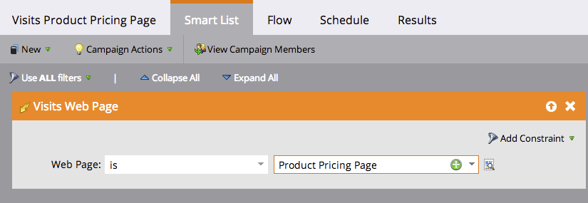

# Moments intéressants dans MSC {#interesting-moments-in-msc}

Les moments intéressants sont la clé de la communication avec votre équipe commerciale via Marketing Connect.

>[!AVAILABILITY]
>
>
>Ils sont accessibles uniquement aux clients [Marketing Sales Insight](http://docs.marketo.com/x/2Akt) et Marketing Sales Connect.

## Quel moment intéressant ?  {#what-is-an-interesting-moment}

C&#39;est à vous de décider ! Vous décidez quelles informations sont pertinentes pour votre équipe commerciale. Votre équipe commerciale peut vouloir savoir quand un prospect :

* Visite la page de tarification de votre site Web
* Cliquez sur un lien dans un message électronique d’annonce de nouveau produit.
* Demande une démonstration de produit

## Comment créer un moment intéressant ? {#how-do-i-create-an-interesting-moment}

1. Choisissez une campagne [s](../../../product-docs/core-marketo-concepts/smart-campaigns/understanding-smart-campaigns.md) [mart](http://docs.marketo.com/display/docs/smart+campaigns), de préférence une campagne intéressante pour votre équipe commerciale si elle est déclenchée.

   

1. Faites glisser le curseur sur l’étape de flux **Moments intéressants**.

   

1. Sélectionnez un **type** (Courriel, Jalon ou Web).

   

1. Ecrivez un message à votre équipe commerciale dans le champ **Description** qui explique pourquoi cette action est importante.

   

   >[!NOTE]
   >
   >Marketo ajoute également la date à laquelle il s’est produit et comment le moment intéressant a été ajouté (par exemple, action de piste > étape de flux, API SOAP).

## A quoi ressemble un moment intéressant sur le marché ?  {#what-does-an-interesting-moment-look-like-in-marketo}

Les moments intéressants s&#39;afficheront dans un [journal d&#39;activité du prospect](../../../product-docs/core-marketo-concepts/smart-lists-and-static-lists/managing-people-in-smart-lists/using-the-person-detail-page.md).

## À quoi ressemble un moment intéressant dans Sales Connect ? {#what-does-an-interesting-moment-look-like-in-sales-connect}

Les moments intéressants s’afficheront en temps réel dans le flux dynamique d’un utilisateur. Nous utilisons l&#39;identifiant de propriétaire principal de Salesforce pour montrer aux utilisateurs les moments intéressants de pistes pertinentes dont ils sont propriétaires. Les utilisateurs peuvent rapidement suivre les pistes par courriel, téléphone ou campagne de vente en cliquant sur la liste déroulante en regard du nom de la piste.

