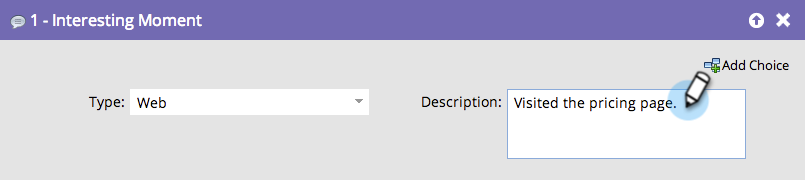

# Moments significatifs de la [!DNL Sales Connect] {#interesting-moments-in-sales-connect}

Les moments intéressants sont la clé pour communiquer avec votre équipe de vente à travers [!DNL Marketo Sales Connect].

>[!AVAILABILITY]
>
>Ils sont disponibles uniquement pour les clients [Marketo Sales Insight](/help/marketo/product-docs/marketo-sales-insight/msi-for-salesforce/features/tabs-in-the-msi-panel/interesting-moments/using-interesting-moments.md) et [!DNL Marketo Sales Connect].

>[!PREREQUISITES]
>
>* Vous devez disposer d’une [&#x200B; connexion au CRM Salesforce &#x200B;](/help/marketo/product-docs/marketo-sales-connect/crm/salesforce-integration/connect-your-sales-connect-account-to-salesforce.md){target="_blank"}
>* Vous devez être le prospect ou le propriétaire du contact dans Salesforce
>* Vous devez avoir accès à [accorder l’accès à la connexion Marketo Engage](/help/marketo/product-docs/marketo-sales-connect/marketo/granting-access-to-users.md){target="_blank"}

## Qu&#39;est-ce qu&#39;un moment intéressant ? {#what-is-an-interesting-moment}

C&#39;est à toi de voir ! Vous décidez quelles informations sont pertinentes pour votre équipe de vente. Votre équipe de vente peut vouloir savoir quand un prospect :

* Visite la page de tarification de votre site web
* Clique sur un lien dans un e-mail d’annonce de nouveau produit.
* Demande une démonstration du produit

## Comment créer un moment intéressant ? {#how-do-i-create-an-interesting-moment}

1. Choisissez une [campagne intelligente](/help/marketo/product-docs/core-marketo-concepts/smart-campaigns/understanding-smart-campaigns.md), de préférence une campagne que votre équipe de vente trouverait intéressante si elle était déclenchée.

   

1. Faites glisser sur l’étape de flux **[!UICONTROL Moments significatifs]**.

   

1. Sélectionnez un **type** ([!UICONTROL E-mail], [!UICONTROL Jalon] ou [!UICONTROL Web]).

   

1. Dans le champ **[!UICONTROL Description]**, envoyez un message à votre équipe commerciale pour expliquer l’importance de cette action.

   

   >[!NOTE]
   >
   >Marketo ajoutera également la date à laquelle il s’est produit et la manière dont le moment intéressant a été ajouté (c’est-à-dire action de lead > étape de flux, API SOAP).

## À quoi ressemble un moment intéressant dans Marketo ?  {#what-does-an-interesting-moment-look-like-in-marketo}

Les moments significatifs seront affichés dans le [journal d’activité du prospect](/help/marketo/product-docs/core-marketo-concepts/smart-lists-and-static-lists/managing-people-in-smart-lists/using-the-person-detail-page.md).

## À quoi ressemble un moment intéressant en [!DNL Sales Connect] ? {#what-does-an-interesting-moment-look-like-in-sales-connect}

Les moments significatifs seront affichés en temps réel dans le flux dynamique d’un utilisateur. Nous utilisons l’ID du propriétaire du prospect dans [!DNL Salesforce] pour afficher les moments intéressants des prospects pertinents dont ils sont propriétaires. Les utilisateurs peuvent rapidement suivre les prospects par e-mail, téléphone ou campagne commerciale en cliquant sur la liste déroulante en regard du nom du prospect.

