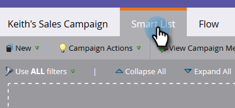

# Rendre une campagne visible par [!DNL Sales Connect] utilisateurs {#make-a-campaign-visible-to-sales-connect-users}

Les campagnes ne peuvent être partagées que si elles sont rendues visibles. Voici comment faire.

1. Sélectionnez (ou créez) la campagne que vous souhaitez partager.

   

1. Cliquez sur l’onglet **[!UICONTROL Liste dynamique]**.

   

1. Ajoutez le déclencheur [!UICONTROL La campagne est demandée].

   

1. Pour la source, choisissez « [!UICONTROL is] » **[!UICONTROL API de service web]**.

   

1. Cliquez sur l’onglet **[!UICONTROL Flux]**.

   

1. Ajoutez l’action de flux [!UICONTROL &#x200B; Moment intéressant &#x200B;].

   

1. Pour [!UICONTROL &#x200B; Type &#x200B;], sélectionnez **[!UICONTROL Web]**.

   

1. Dans la zone [!UICONTROL Description], écrivez un message à votre équipe commerciale. Dans cet exemple, nous utilisons des jetons pour spécifier le formulaire qui a été rempli.

   

1. Cliquez sur l’onglet **[!UICONTROL Planifier]** et **[!UICONTROL Activer]** la campagne.

   
