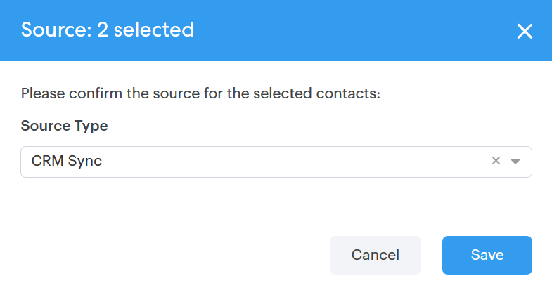

# Actions en bloc sur les personnes {#bulk-actions-on-people}

Pour gagner du temps, vous pouvez utiliser vos contacts en masse.

La première étape de toutes les actions en bloc disponibles consiste à sélectionner plusieurs contacts, puis à cliquer sur le point (trois points verticaux).

## Ajouter des personnes au groupe {#add-people-to-group}

Ajoutez plusieurs personnes à un groupe en même temps.

## Source {#source}

Nous assignons automatiquement une source à chaque contact qui entre dans la base de données. Utilisez cette étape pour mettre à jour cette source.

>[!NOTE]
>
>Les sources ne sont pas personnalisables.

## Autorisation {#authorization}

En conformité avec le [RGPD](https://eugdpr.org/), utilisez l’autorisation pour indiquer comment vous avez reçu l’autorisation d’interagir avec ces contacts.

## Se désabonner {#unsubscribe}

Désabonnez-vous en masse des contacts qui ne souhaitent plus recevoir de correspondance de votre part.

## Supprimer {#delete}

Supprimer des contacts en masse. Les étapes complètes sont disponibles [ici](/help/marketo/product-docs/marketo-sales-connect/people/managing-contacts/creating-and-deleting-contacts.md).

