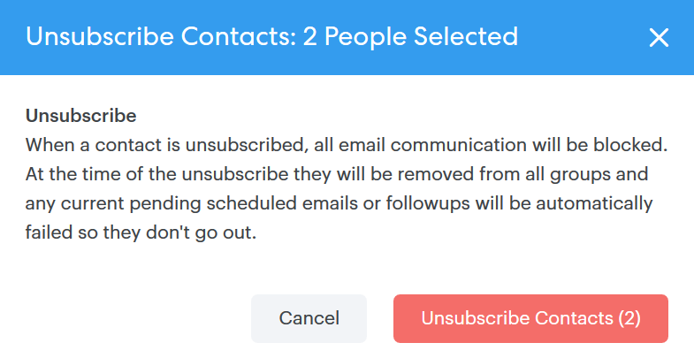

# Actions en masse sur les personnes {#bulk-actions-on-people}

Il y a quelques choses que vous pouvez faire avec vos contacts en bloc pour gagner du temps.

La première étape de toutes les actions en masse disponibles consiste à sélectionner deux contacts ou plus, puis à cliquer sur le point (trois points verticaux).

## Ajouter les personnes au groupe {#add-people-to-group}

Ajoutez plusieurs personnes à un groupe en même temps.

## Source {#source}

Nous affectons automatiquement une source à chaque contact qui entre dans la base de données. Utilisez cette étape pour mettre à jour cette source.

>[!NOTE]
>
>Les sources ne sont pas personnalisables.

## Autorisation {#authorization}

Conformément au [RGPD](https://eugdpr.org/), utilisez l&#39;autorisation pour indiquer comment vous avez reçu l&#39;autorisation de communiquer avec ces contacts.

## Désabonner {#unsubscribe}

Effectuez un désabonnement en masse sur les contacts qui ne souhaitent plus recevoir de correspondance de votre part.

## Supprimer {#delete}

Supprimer les contacts en bloc. Vous trouverez toutes les étapes [ici](/help/marketo/product-docs/marketo-sales-connect/people/managing-contacts/creating-and-deleting-contacts.md).

