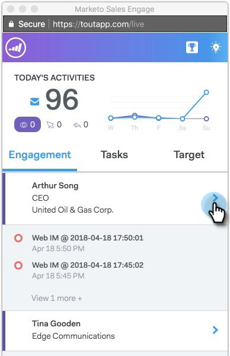

# Connectez vos pistes marketing avec les pistes de connexion commerciale {#connect-your-marketo-leads-with-sales-connect-leads}

Afin de synchroniser vos données avec Marketo avec le plus de précision possible, MSC exige que l&#39;enregistrement de la personne comporte un ID de Marketo enregistré. Afin de synchroniser l&#39;identifiant du marché dans MSC, vous pouvez cliquer sur le chevron en regard d&#39;un moment intéressant. Lorsqu’un moment intéressant apparaît dans le flux en direct, cliquez sur la flèche de liste déroulante et l’enregistrement de la personne sera ajouté à la base de données MSC avec l’ID de marketing.

Vous pouvez désormais utiliser les boutons d’engagement du flux en direct, de Salesforce, des modules externes de messagerie ou de l’Application web pour ajouter des pistes aux campagnes marketing. Créez une tâche d&#39;appel à rappeler pour le suivi et laissez des notes à utiliser comme notes d&#39;appel pendant l&#39;appel.
