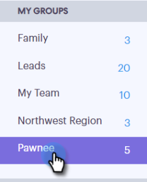
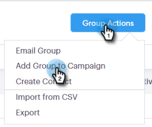

# Connexion à un groupe {#connecting-with-a-group}

Découvrez comment envoyer un courriel à un groupe entier ou ajouter un groupe à une campagne.

## Action de groupe : Courriel {#group-action-email}

1. Sélectionnez le groupe que vous souhaitez envoyer par courriel.

   

1. Cliquez sur le bouton **Actions de groupe** et sélectionnez **Groupe de courriel**.

   

1. Remplissez votre e-mail et planifiez/envoyez-le.

   

   Et c&#39;est tout. Tous les membres de ce groupe recevront le courriel.

## Action de groupe : Ajouter au Campaign de vente {#group-action-add-to-sales-campaign}

1. Sélectionnez le groupe que vous souhaitez ajouter à une campagne.

   

1. Cliquez sur le bouton **Actions de groupe** et sélectionnez **Ajouter le groupe à Campaign**.

   

1. Vérifiez que les personnes appropriées ont été sélectionnées et cliquez sur **Suivant**.

   

   >[!NOTE]
   >
   >Vous pouvez voir une option à ajouter à un Campaign marketing. [C&#39;est un autre article](http://docs.marketo.com/x/CwDh).

1. Sélectionnez une campagne (vous pouvez sélectionner une catégorie pour restreindre vos résultats) et cliquez sur **Suivant**.

   

1. Effectuez les modifications souhaitées et cliquez sur **Suivant**.

   

1. Planifiez la campagne et cliquez sur **Début**.

   

