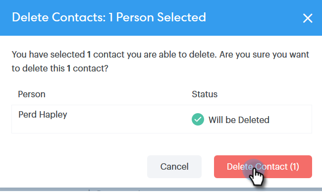

# Création et suppression de contacts {#creating-and-deleting-contacts}

## Créer des contacts {#creating-contacts}

1. Sur la page [!UICONTROL Personnes], cliquez sur le bouton **[!UICONTROL Regrouper les actions]** et sélectionnez **[!UICONTROL Créer un contact]**.

   

1. Saisissez le prénom/nom et l’adresse e-mail, ainsi que toute autre information que vous souhaitez. Cliquez sur **[!UICONTROL Créer]** lorsque vous avez terminé, ou **[!UICONTROL Créer et ajouter]** pour ajouter d’autres contacts.

   

   >[!TIP]
   >
   >Vous souhaitez ajouter plusieurs contacts à la fois ? [Cliquez ici](/help/marketo/product-docs/marketo-sales-connect/people/managing-contacts/import-contacts-via-csv.md) pour découvrir comment importer des contacts au format CSV.

## Suppression de contacts {#deleting-contacts}

1. Dans la page [!UICONTROL Personnes], cochez la case du contact que vous souhaitez supprimer.

   

   >[!NOTE]
   >
   >Pour supprimer plusieurs contacts, il vous suffit de sélectionner plusieurs personnes. Les étapes restantes seraient les mêmes.

1. Cliquez sur le point (trois points verticaux) et sélectionnez **[!UICONTROL Supprimer]**.

   

1. Cliquez sur **[!UICONTROL Supprimer le contact]** pour confirmer.

   
