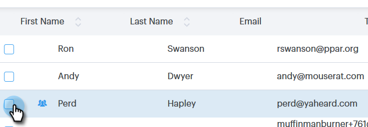

# Création et suppression de contacts {#creating-and-deleting-contacts}

## Création de contacts {#creating-contacts}

1. Dans la page Personnes, cliquez sur le bouton **Actions de groupe** et sélectionnez **Créer un contact**.

   

1. Entrez le prénom/nom et l&#39;adresse électronique, ainsi que toute autre information que vous souhaitez. Cliquez sur **Créer** une fois terminé, ou **Créer et Ajouter nouveau** pour ajouter d&#39;autres contacts.

   

   >[!TIP]
   >
   >Souhaitez-vous ajouter plusieurs contacts à la fois ? [Cliquez ](http://docs.marketo.com/x/VADb) ici pour savoir comment importer des contacts au format CSV.

## Suppression de contacts {#deleting-contacts}

1. Dans la page Personnes, cochez la case du contact que vous souhaitez supprimer.

   

   >[!NOTE]
   >
   >Pour supprimer plusieurs contacts, il vous suffit de sélectionner plusieurs personnes. Les étapes restantes seraient les mêmes.

1. Cliquez sur le point (trois points verticaux) et sélectionnez Supprimer.

   

1. Cliquez sur Supprimer le contact pour confirmer.

   
