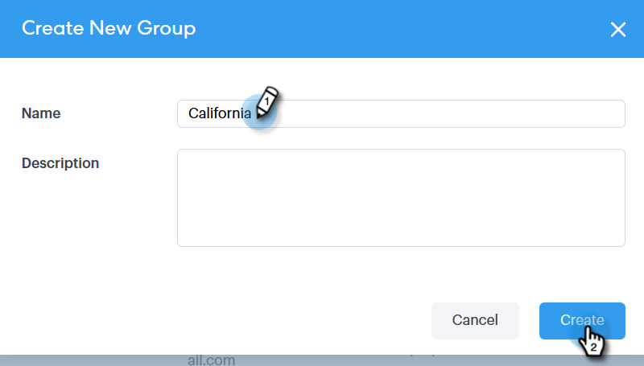
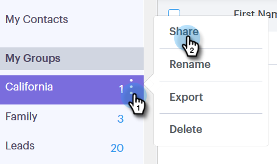
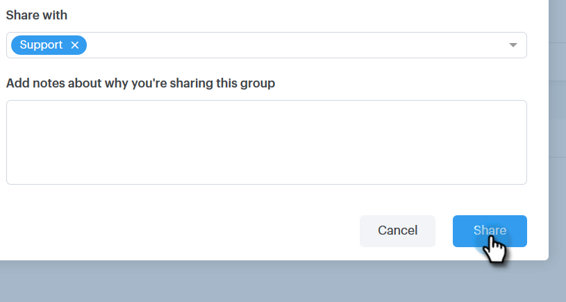

# Gérer les groupes {#manage-groups}

Découvrez comment gérer vos groupes dans Sales Connect.

## Créer un groupe {#create-a-group}

1. Dans la page Personnes, cliquez sur le signe **plus** en regard de Groupes.

   

1. Nommez votre groupe et cliquez sur **Créer**.

   

   C&#39;est tout !

## Ajouter des contacts à un groupe {#add-contacts-to-a-group}

1. Dans la page Personnes, recherchez et sélectionnez le groupe auquel vous souhaitez ajouter des personnes.

   

1. Cliquez sur **Actions de groupe** et sélectionnez **Créer un contact**.

   

   >[!NOTE]
   >
   >Ceci ajoute un contact à la fois. Pour ajouter plusieurs contacts en même temps, suivez [ces étapes](http://docs.marketo.com/x/VADb).

1. Renseignez les informations du contact et cliquez sur **Créer** (ou **Créer et Ajouter** pour en ajouter un autre).

   

   Et vous avez fini !

   >[!NOTE]
   >
   >Vous devrez peut-être cliquer sur Actualiser pour voir les nouveaux contacts ajoutés.

## Partager un groupe {#share-a-group}

1. Dans la page Personnes, recherchez et sélectionnez le groupe que vous souhaitez partager.

   

1. Cliquez sur le point (trois points verticaux) et sélectionnez **Partager**.

   

1. Cliquez sur la liste déroulante et choisissez l’équipe avec laquelle vous souhaitez partager le groupe.

   

1. Cliquez sur **Partager**.

   

   Vous possédez toujours le groupe, mais il apparaîtra désormais sous Groupes d’équipes.

## Annulation du partage d&#39;un groupe {#unshare-a-group}

1. Dans la page Personnes, recherchez et sélectionnez le groupe que vous souhaitez annuler le partage.

   

1. Cliquez sur le point (trois points verticaux) et sélectionnez **Partager**.

   

1. Cliquez sur le **X** en regard de l’équipe avec laquelle vous avez partagé le groupe, puis cliquez en dehors du module.

   

   Le groupe n’est plus partagé.

## Renommer un groupe {#rename-a-group}

1. Dans la page Personnes, recherchez et sélectionnez le groupe que vous souhaitez renommer.

   

1. Cliquez sur le point (trois points verticaux) et sélectionnez **Renommer**.

   

1. Saisissez le nouveau nom et appuyez sur Entrée.

   

## Supprimer un groupe {#delete-a-group}

1. Dans la page Personnes, recherchez et sélectionnez le groupe à supprimer.

   

1. Cliquez sur le point (trois points verticaux) et sélectionnez **Supprimer**.

   

1. Cliquez sur **Supprimer** pour confirmer.

   

