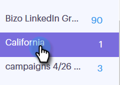
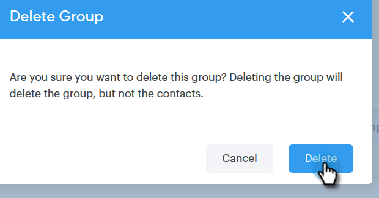

# Gestion des groupes {#manage-groups}

Découvrez comment gérer vos groupes dans Sales Connect.

## Création d’un groupe {#create-a-group}

1. Dans la page Personnes, cliquez sur le **+** en regard de Groupes.

   

1. Nommez votre groupe et cliquez sur **Créer**.

   

   C&#39;est tout !

## Ajout de contacts à un groupe {#add-contacts-to-a-group}

1. Dans la page Personnes, recherchez et sélectionnez le groupe auquel vous souhaitez ajouter des personnes.

   

1. Cliquez sur **Actions de groupe** et sélectionnez **Créer un contact**.

   

   >[!NOTE]
   >
   >Un contact à la fois sera ainsi ajouté. Pour ajouter plusieurs contacts en même temps, suivez [ces étapes](/help/marketo/product-docs/marketo-sales-connect/people/managing-contacts/import-contacts-via-csv.md).

1. Renseignez les informations du contact et cliquez sur **Créer** (ou **Créer et ajouter un nouveau** pour en ajouter un autre).

   

   Et vous avez fini !

   >[!NOTE]
   >
   >Vous devrez peut-être appuyer sur Actualiser pour voir les nouveaux contacts ajoutés.

## Partage d’un groupe {#share-a-group}

1. Sur la page Personnes, recherchez et sélectionnez le groupe que vous souhaitez partager.

   

1. Cliquez sur le point (trois points verticaux) et sélectionnez **Partager**.

   

1. Cliquez sur la liste déroulante et sélectionnez l’équipe avec laquelle vous souhaitez partager le groupe.

   

1. Cliquez sur **Partager**.

   

   Vous êtes toujours propriétaire du groupe, mais il apparaîtra désormais sous Groupes d’équipes.

## Annulation du partage d’un groupe {#unshare-a-group}

1. Dans la page Personnes, recherchez et sélectionnez le groupe dont vous souhaitez annuler le partage.

   

1. Cliquez sur le point (trois points verticaux) et sélectionnez **Partager**.

   

1. Cliquez sur le **X** en regard de l’équipe avec laquelle vous avez partagé le groupe, puis cliquez en dehors du modal.

   

   Le partage du groupe est désormais annulé.

## Renommer un groupe {#rename-a-group}

1. Dans la page Personnes, recherchez et sélectionnez le groupe que vous souhaitez renommer.

   

1. Cliquez sur le point (trois points verticaux) et sélectionnez **Renommer**.

   

1. Saisissez le nouveau nom et appuyez sur Entrée.

   

## Suppression d’un groupe {#delete-a-group}

1. Dans la page Personnes, recherchez et sélectionnez le groupe à supprimer.

   

1. Cliquez sur le point (trois points verticaux) et sélectionnez **Supprimer**.

   

1. Cliquez sur **Supprimer** pour confirmer.

   
