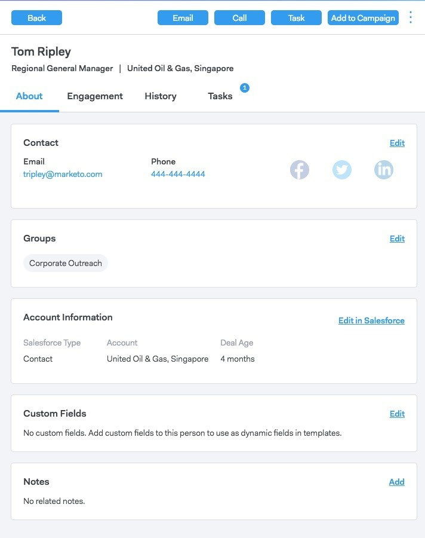

# Vue Détails de la personne {#person-detail-view}

La vue Détails de la personne fournit un profil détaillé de chaque personne dans votre compte MSC.

## Accès {#how-to-access}

1. Pour accéder à la vue des détails de la personne, cliquez sur l’onglet **Personnes** .

   

1. Cliquez sur la personne souhaitée.

   

   >[!TIP]
   >
   >Où que vous voyiez le nom d’une personne, vous pouvez cliquer dessus et accéder à son Affichage des détails de la personne.

## Onglet À propos {#about-tab}

Inclut toutes les coordonnées de la personne.

**Carte de contact**

* Contient des coordonnées telles que : adresse électronique, nom, société, titre, numéro de téléphone et liens vers les médias sociaux

**Groupes**

* Affiche et gère les groupes dont fait partie cette personne.

**Informations sur le compte**

* Peut ajouter une personne à Salesforce
* Extraction des informations de compte et de piste/contact de Salesforce

**Champs personnalisés**

* Ajouter ou supprimer des champs personnalisés qui peuvent être utilisés comme champs dynamiques dans vos modèles et campagnes

**Notes**

* Création de notes personnalisées

## Onglet Engagement {#engagement-tab}

Découvrez comment cette personne s’engage dans votre travail de sensibilisation.

**Activité Connect des ventes**

* Voir Activités d’engagement à partir de vos emails de vente et campagnes

**Activité marketing**

* Découvrez comment votre personne interagit avec les campagnes marketing

## Onglet Historique {#history-tab}

Affiche votre historique de diffusion. Inclut des emails, des campagnes et des appels.

**Campagnes commerciales**

* Afficher toutes les campagnes actives ou terminées auxquelles cette personne appartient

**Campagnes marketing**

* Afficher toutes les campagnes marketing auxquelles cette personne est membre

**Courriers électroniques de vente**

* Afficher les courriers électroniques que vous avez envoyés à cette personne et les mesures d’engagement

**Appels de vente**

* Afficher tous les appels que vous avez passés à cette personne

## Onglet Tâches {#tasks-tab}

Gérer les tâches associées à cette personne.

Actions que vous pouvez effectuer :

* Modification ou suppression d’une tâche
* Afficher la date d’échéance
* Cliquez sur le Type pour lancer le Téléphone de vente si appel, Composer le courrier électronique si courrier électronique, Linkedin si courrier électronique et Note personnalisée si personnalisé.
* Marquer une tâche comme terminée
