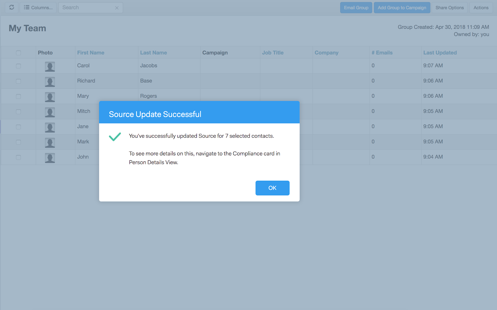

# [!DNL Sales Connect] et conformité au RGPD {#sales-connect-and-gdpr-compliance}

Le Règlement général sur la protection des données (RGPD) est la législation de l’Union européenne qui est entrée en vigueur le 25 mai 2018.

## Vue d’ensemble {#overview}

Son objectif est de renforcer les droits des personnes concernées au sein de l&#39;Union européenne (UE) et de l&#39;Espace économique européen (EEE) en ce qui concerne la manière dont leurs données personnelles sont utilisées et protégées. « Données personnelles » désigne toute information relative à une personne physique identifiée ou identifiable.

Le RGPD s’articule autour de six principes clés (détaillés à l’article 5 de la législation) :

1. Transparence sur la manière dont les données seront utilisées et leur finalité.
1. Veiller à ce que les données collectées ne soient utilisées qu&#39;aux fins explicitement spécifiées au moment de la collecte.
1. Limiter la collecte de données à ce qui est nécessaire pour atteindre l&#39;objectif pour lequel elles sont collectées.
1. S’assurer que les données sont exactes.
1. Stocker les données uniquement aussi longtemps que nécessaire dans le cadre de l’objectif prévu.
1. Prévention de l&#39;utilisation non autorisée ou de la perte accidentelle des données par le déploiement de mesures de sécurité appropriées.

De plus, il y a une nouvelle exigence de reddition de comptes pour pouvoir démontrer comment la conformité est gérée et suivie. Cela implique de tenir des registres indiquant comment et pourquoi les données personnelles ont été collectées, ainsi que la documentation des processus mis en place pour les protéger.

## À qui s&#39;applique-t-il ? {#to-whom-does-it-apply}

Le RGPD s’applique à toute organisation à l’intérieur ou à l’extérieur de l’UE qui commercialise des biens ou des services et/ou qui suit les comportements des personnes concernées au sein de l’UE et de l’EEE. Si vous faites affaire avec des personnes concernées en Europe, et que cela implique de traiter leurs données personnelles, cette législation s’applique à vous. Les sanctions en cas de non-conformité sont importantes, avec de lourdes amendes pour les personnes qui enfreignent le règlement. L’amende maximale pour une violation unique est de 20 millions d’euros ou 4 % du chiffre d’affaires annuel mondial, le montant le plus élevé s’appliquant.

## Implications pour le marketing {#implications-for-marketing}

Les marketeurs visent à créer des expériences client qui soient personnelles et humaines, fondées sur la confiance et fournies avec soin. Bien que le RGPD n’utilise pas ces termes, ses objectifs sont les mêmes : respecter les droits des clients et gagner leur confiance. Pour établir et maintenir cette confiance, les professionnels du marketing doivent être attentifs au comment, au quand et aux raisons pour lesquelles leurs clients souhaitent être engagés. Il est essentiel que les préférences des clients soient respectées, non seulement en tant qu’exigence légale, mais également en tant que base des pratiques d’engagement axées sur les clients.

La façon dont les professionnels du marketing répondent à ces attentes plus élevées en matière de collecte, d’utilisation et de sécurité des données personnelles qui sont couramment utilisées dans le cadre de leur travail est essentielle et Marketo peut vous aider à répondre à ces attentes.

Il existe deux aspects clés du RGPD pour lesquels les marketeurs doivent examiner les pratiques passées, actuelles et futures. Le premier est le consentement de la personne pour traiter ses données personnelles, et le second est la responsabilité, à savoir être en mesure de démontrer comment les principes du RGPD sont respectés.

Nous fournissons des informations détaillées sur le consentement et la responsabilité au sein de la plateforme Marketo dans notre e-book, le [RGPD et The Marketer](https://www.marketo.com/ebooks/the-gdpr-and-the-marketer/). Dans cet article, cependant, nous nous concentrerons spécifiquement sur les nouvelles fonctionnalités de [!DNL Marketo Sales Connect] qui aideront votre organisation à se conformer aux règles du RGPD.

## Conformité au RGPD en [!DNL Marketo Sales Connect] {#gdpr-compliance-in-marketo-sales-connect}

[!DNL Marketo Sales Connect] est une application puissante, faisant partie de l’[!DNL Marketo Engagement Platform], qui fournit un workflow et une vue uniques pour que les équipes de vente et de marketing puissent, ensemble, accélérer le pipeline grâce à un engagement collaboratif. La nouvelle fonctionnalité d’[!DNL Marketo Sales Connect] a été créée spécifiquement dans la perspective de la conformité au RGPD. Nous présenterons les trois fonctions et expliquerons comment elles, lorsqu’elles sont utilisées correctement, aideront votre organisation à respecter le RGPD.

## Carte de conformité {#compliance-card}

[!DNL Marketo Sales Connect] comprend une carte de conformité dans la vue Détails de la personne pour fournir des informations essentielles sur le type d’autorisation d’un contact, ainsi que son type Source. Cela permet aux utilisateurs et utilisatrices d’ajouter et de suivre facilement des informations essentielles pour la confidentialité des données, et les aide à prendre des décisions plus éclairées sur la stratégie de campagne/de sensibilisation.

Type d’autorisation de contact

Dans la carte de conformité, les utilisateurs peuvent suivre la base juridique du traitement des données personnelles d’un contact à l’aide du menu déroulant Autorisation . Comprendre le type d’autorisation d’un contact permet aux utilisateurs [!DNL Marketo Sales Connect] de prendre des décisions plus éclairées concernant les pratiques de sensibilisation, en s’assurant que chaque campagne ou engagement est légal et approprié.

Les utilisateurs ont le choix entre de nombreuses options, notamment :

* Consentement
* Intérêt légitime
* Exécution d’un contrat
* Conformité aux obligations légales
* Protection des intérêts vitaux
* Intérêt public / autorité officielle
* Autres

Type de Source du contact

Dans la nouvelle carte de conformité, les utilisateurs peuvent suivre la source d’un contact. Le type de Source définit l’origine des informations d’un contact lors de leur chargement initial dans [!DNL Marketo Sales Connect]. Comprendre le type de source d’un contact permet également de prendre des décisions concernant les pratiques de sensibilisation et de déterminer quels autres systèmes ou emplacements les données personnelles sont stockées, en veillant à ce que chaque engagement soit conforme à la législation RGPD.

Là encore, les utilisateurs peuvent choisir parmi de nombreuses options de liste déroulante, notamment :

* Synchronisation CRM
* Importer
* Télécharger manuellement
* Extension [!DNL Chrome]
* Autres

Modification de la carte Conformité

Lorsque la vue Détails de la personne est ouverte, cliquez sur **[!UICONTROL Modifier]** dans la carte Conformité.

Deux listes déroulantes s’affichent : [!UICONTROL &#x200B; Type d’autorisation &#x200B;] et [!UICONTROL Type de Source].

Si vous choisissez « [!UICONTROL Consentement] » comme [!UICONTROL Type d’autorisation], deux champs obligatoires s’affichent : « [!UICONTROL Date du consentement] » et « [!UICONTROL Objectif du traitement] ». Ces deux champs ne s’appliquent pas aux autres options.

Si « [!UICONTROL Autre] » est choisi pour le type [!UICONTROL Type d’autorisation] ou le type [!UICONTROL Source], vous pouvez saisir du texte pour décrire le type Source.

Actions en bloc ** [!DNL Marketo Sales Connect] permet également de mettre à jour en bloc les types Source et d’autorisation d’un contact, ce qui permet de gagner un temps précieux dans le processus de conformité.

Lorsque vous sélectionnez un ou plusieurs contacts dans la page [!UICONTROL Personnes], les boutons Autorisation et Source s&#39;affichent dans le conteneur supérieur. À l’aide de ces boutons, vous pouvez définir l’autorisation ou le Source de plusieurs contacts simultanément.

Lorsque vous cliquez sur la boîte de dialogue modale Autorisation, un pop-up contenant des options déroulantes correspondant à celles de la carte Conformité s’affiche.

Une fois le type d’autorisation mis à jour, vous recevez un pop-up de confirmation et vous pouvez voir les détails mis à jour dans la carte Conformité dans la vue Détails de la personne.

De même, le type Source peut également être mis à jour en bloc en cliquant sur la boîte de dialogue modale Source.

Après avoir sélectionné le type de Source approprié pour les contacts sélectionnés, une fenêtre de confirmation s’affiche pour confirmer la réussite de la mise à jour.

## Exporter Des Données De Contact Depuis [!DNL Marketo Sales Connect] {#exporting-contact-data-from-marketo-sales-connect}

Vous avez la possibilité d’exporter des informations de contact à partir de la vue Détails de la personne. L’exportation télécharge un fichier .CSV avec les colonnes suivantes :

<table>
 <colgroup>
  <col>
  <col>
  <col>
 </colgroup>
 <tbody>
  <tr>
   <td>[!UICONTROL Prénom]</td>
   <td>[!UICONTROL Website]</td>
   <td>[!DNL Facebook]</td>
  </tr>
  <tr>
   <td>[!UICONTROL Nom]</td>
   <td>[!UICONTROL Other]</td>
   <td>[!DNL Twitter]</td>
  </tr>
  <tr>
   <td>[!UICONTROL Company]</td>
   <td>[!UICONTROL Mis À Jour À]</td>
   <td>[!DNL LinkedIn]</td>
  </tr>
  <tr>
   <td>[!UICONTROL Title]</td>
   <td>[!UICONTROL Créé À]</td>
   <td>[!UICONTROL Exporté À]</td>
  </tr>
  <tr>
   <td>[!UICONTROL Email ID]</td>
   <td>[!UICONTROL Salesforce ID]</td>
   <td> </td>
  </tr>
  <tr>
   <td>[!UICONTROL Phone Number]</td>
   <td>[!UICONTROL Person ID]</td>
   <td> </td>
  </tr>
 </tbody>
</table>

>[!NOTE]
>
>Cette opération ne peut être effectuée que par contact à la fois. Il n’existe actuellement aucune fonctionnalité permettant l’exportation en bloc de contacts.

Pour exporter les informations de contact, cliquez sur les trois points verticaux dans l’en-tête d’affichage des détails de la personne et sélectionnez **[!UICONTROL Exporter]**. Le fichier .CSV sera automatiquement téléchargé.

>[!NOTE]
>
>Le RGPD exige également la possibilité de supprimer des contacts de l’interface utilisateur, mais [!DNL Marketo Sales Connect] possède déjà cette fonctionnalité.

## Désabonnements {#unsubscribes}

Un domaine souvent mal compris du RGPD concerne les contacts qui se désabonnent de la base de données de l’organisation. Afin de respecter les nouvelles règles de protection des données des personnes qui choisissent de se désabonner, les fonctionnalités suivantes ont été incluses dans [!DNL Marketo Sales Connect] :

**Liens de désabonnement :** les liens de désabonnement seront automatiquement ajoutés à tous les e-mails envoyés à partir de l&#39;application web [!DNL Sales Connect] pour s&#39;assurer que les contacts disposent d&#39;un moyen accessible pour se désinscrire.
**Synchronisation des désabonnements :** les utilisateurs peuvent synchroniser les désabonnements avec leur CRM ([!DNL Salesforce]) pour s’assurer que les désabonnements sont à jour.
**Historique de désabonnement :** les utilisateurs peuvent afficher l’historique des désinscriptions et des inscriptions dans la vue des détails de la personne.
**Suppression du désabonnement :** pour réactiver un contact désabonné, l’utilisateur doit disposer de droits d’administrateur et démontrer qu’il a donné son nouveau consentement pour le contacter.

## Futures mises à jour {#future-updates}

En tant que défenseur enthousiaste de la puissance et de l’orientation client de l’économie de l’engagement, Marketo comprend l’importance de placer la confidentialité et la protection des données entre les mains de la personne concernée. Comme pour les autres lois sur la protection des données, la conformité au RGPD requiert un engagement à la fois de Marketo et de nos clients. Cet article a pour but de vous aider à utiliser Marketo de manière appropriée afin de garantir la conformité de votre entreprise au RGPD.

Nous continuerons à suivre de près les directives RGPD applicables publiées par les autorités réglementaires et la législation associée. Des mises à jour seront publiées sur notre Centre de gestion de la confidentialité à l’adresse [trust.marketo.com](https://trust.marketo.com).
