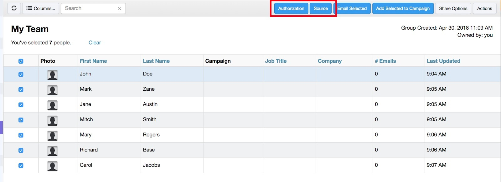

# Conformité aux règles de la connexion commerciale et du RGPD {#sales-connect-and-gdpr-compliance}

Le Règlement général sur la protection des données (RGPD) est une législation européenne en matière d&#39;Union qui est entrée en vigueur le 25 mai 2018.

## Présentation {#overview}

Son objectif est de renforcer les droits des personnes concernées au sein de l&#39;Union européenne (UE) et de l&#39;Espace économique européen (EEE) en ce qui concerne l&#39;utilisation et la protection de leurs données à caractère personnel. &quot;Données personnelles&quot; désigne toute information relative à une personne physique identifiée ou identifiable.

Le RGPD est structuré autour de six principes fondamentaux (détaillés à l&#39;article 5 de la législation) :

1. Transparence quant à la manière dont les données seront utilisées et à quoi elles serviront.
1. Veiller à ce que les données collectées ne soient utilisées qu&#39;aux fins explicitement spécifiées au moment de la collecte.
1. Limiter la collecte des données à ce qui est nécessaire pour atteindre l’objectif pour lequel elle est collectée.
1. S’assurer que les données sont exactes.
1. Stockage des données uniquement le temps nécessaire dans le cadre de l’objectif prévu.
1. Prévention de l&#39;utilisation non autorisée ou de la perte accidentelle des données par le déploiement de mesures de sécurité appropriées.

De plus, il y a une nouvelle obligation de rendre compte pour être en mesure de démontrer comment la conformité est gérée et suivie. Cela signifie tenir des registres sur la manière et les raisons de la collecte des données personnelles ainsi que la documentation des processus mis en place pour les protéger.

## À qui s&#39;applique-t-elle ? {#to-whom-does-it-apply}

Le RGD s&#39;applique à toute organisation à l&#39;intérieur ou à l&#39;extérieur de l&#39;UE qui commercialise des biens ou des services et/ou suit le comportement des personnes concernées au sein de l&#39;UE et de l&#39;EEE. Si vous faites affaire avec des personnes concernées en Europe qui impliquent le traitement de leurs données à caractère personnel, cette législation s&#39;applique à vous. Les sanctions en cas de non-respect sont importantes, avec de lourdes amendes pour ceux qui enfreignent le règlement ; l&#39;amende maximale pour une seule infraction est de 20 millions d&#39;euros, soit 4 % du chiffre d&#39;affaires annuel mondial, selon la valeur la plus élevée.

## Implications pour le marketing {#implications-for-marketing}

Les marketeurs cherchent à créer des expériences client qui se sentent personnelles et humaines, fondées sur la confiance et livrées avec soin. Bien que le RGPD n’utilise pas ces termes, les objectifs sont les mêmes : respecter les droits des clients et gagner leur confiance. Pour établir et maintenir cette confiance, les spécialistes du marketing doivent être conscients de la manière, du moment et des raisons pour lesquels leurs clients souhaitent s’engager. Il est essentiel que les préférences des clients soient respectées, non seulement en tant qu&#39;exigence légale, mais en tant que fondement des pratiques d&#39;engagement axées sur les clients.

La manière dont les spécialistes du marketing répondent à ces attentes plus élevées en matière de collecte, d&#39;utilisation et de sécurité des données à caractère personnel qui sont régulièrement utilisées dans le cadre de leur travail est essentielle, et Marketo peut aider à répondre à ces attentes.\
Les spécialistes du marketing doivent examiner les pratiques passées, actuelles et futures sous deux aspects clés du RGMD. Le premier est le consentement de la personne à traiter ses données personnelles, et le second est la responsabilité, c&#39;est-à-dire la capacité de démontrer comment les principes du RMPD sont respectés.

Nous fournissons des informations complètes sur le consentement et la responsabilité au sein de la plate-forme Marketo dans notre livre électronique, [GDPR et The Marketer](http://www.marketo.com/ebooks/the-gdpr-and-the-marketer/). Dans cet article, cependant, nous nous concentrerons spécifiquement sur les nouvelles fonctionnalités de Marketo Sales Connect qui aideront votre entreprise à se conformer aux règles du RGMD.

## Conformité aux RDCM dans Marketing Connect Sales Connect {#gdpr-compliance-in-marketo-sales-connect}

Marketo Sales Connect est une application puissante, qui fait partie de la plate-forme d’engagement marketing, qui fournit un workflow et une vue uniques pour les ventes et le marketing afin de stimuler collectivement le pipeline plus rapidement grâce à l’engagement collaboratif. De nouvelles fonctionnalités de Marketing Connect Sales Connect ont été créées spécifiquement en tenant compte de la conformité aux RGMD. Nous présenterons les trois fonctions et expliquerons comment elles, lorsqu’elles seront utilisées correctement, aideront votre organisation à respecter les RGMD.

## Carte de conformité {#compliance-card}

La Connexion Ventes du marketing comprend une fiche de conformité dans la Vue Détails de la personne pour fournir des informations clés sur le type d’autorisation d’un contact, ainsi que sur son type de source. Cela permet aux utilisateurs d’ajouter et de suivre facilement des informations essentielles à la confidentialité des données, et leur permet de prendre des décisions plus éclairées sur la stratégie de campagne/diffusion.

Type d&#39;autorisation de contact

Dans la fiche de conformité, les utilisateurs peuvent suivre la base légale du traitement des données personnelles d’un contact par le biais de la liste déroulante Autorisation. La compréhension du type d’autorisation d’un contact permet aux utilisateurs de Marketing Cloud Sales Connect de prendre des décisions plus éclairées concernant les pratiques de sensibilisation, en s’assurant que chaque campagne ou engagement est légal et approprié.

Les utilisateurs peuvent choisir parmi de nombreuses options, parmi lesquelles :

* Consentement
* Intérêt légitime
* Exécution d&#39;un contrat
* Respect de l&#39;obligation légale
* Protection des intérêts vitaux
* Intérêt public/Autorité officielle
* Autre

Type de source de contact

Dans la nouvelle fiche de conformité, les utilisateurs peuvent suivre la source d’un contact. Le type de source définit d’où proviennent les informations d’un contact lors du premier transfert dans Marketing Connect Sales Connect. La compréhension du type de source d’un contact aide également à prendre des décisions concernant les pratiques de diffusion externe, ainsi qu’à déterminer quels autres systèmes ou lieux de stockage des données personnelles, en s’assurant que chaque engagement est conforme à la législation sur le RMMD.

Là encore, les utilisateurs disposent de nombreuses options de liste déroulante, parmi lesquelles :

* CRM Sync
* Importer
* Téléchargement manuel
* Extension Chrome
* Autre

Modification de la fiche de conformité

Lorsque la Vue Détails de la personne est ouverte, cliquez sur **Modifier** dans la fiche de conformité.

Deux listes déroulantes s’affichent : Type d&#39;autorisation et type de source.

Si vous choisissez &quot;Consentement&quot; comme type d’autorisation, deux champs obligatoires : &quot;Date de consentement&quot; et &quot;Objet du traitement&quot; s’affichent. Ces deux champs ne s’appliquent pas aux autres options.

Si &quot;Autre&quot; est sélectionné pour le type d&#39;autorisation ou le type de source, vous pouvez saisir du texte pour décrire le type de source.
** 

Actions en masse** Marketo Sales Connect permet également de mettre à jour en bloc les types d&#39;autorisation et de source d&#39;un contact, ce qui permet de gagner un temps précieux dans le processus de conformité.

Lorsque vous sélectionnez un ou plusieurs contacts dans la page Personnes, les boutons Autorisation et Source s’affichent dans le conteneur supérieur. A l’aide de ces boutons, vous pouvez définir simultanément l’autorisation ou la source de plusieurs contacts.

Lorsque vous cliquez sur le module Autorisation, une fenêtre contextuelle contenant des options qui correspondent à celles de la fiche de conformité s&#39;affiche.

Une fois le type d&#39;autorisation mis à jour, vous recevrez une fenêtre contextuelle de confirmation et vous pourrez voir les détails mis à jour dans la fiche de conformité de la Vue de détails sur la personne.

De même, le type de source peut être mis à jour en bloc en cliquant sur le modal Source.

Après avoir sélectionné le type de source correct pour vos contacts sélectionnés, une fenêtre de confirmation s&#39;affiche pour confirmer la mise à jour réussie.

## Exportation des données de contact à partir de Marketing Connect Sales {#exporting-contact-data-from-marketo-sales-connect}

Vous pouvez exporter des informations de contact à partir de la Vue Détails de la personne. L’exportation télécharge un fichier .CSV avec les colonnes suivantes :

<table> 
 <colgroup> 
  <col> 
  <col> 
  <col> 
 </colgroup> 
 <tbody> 
  <tr> 
   <td>Prénom</td> 
   <td>Site Web</td> 
   <td>Facebook</td> 
  </tr> 
  <tr> 
   <td>Nom</td> 
   <td>Autre</td> 
   <td>Twitter</td> 
  </tr> 
  <tr> 
   <td>Société</td> 
   <td>Mis à jour à</td> 
   <td>LinkedIn</td> 
  </tr> 
  <tr> 
   <td>Titre</td> 
   <td>Créé à</td> 
   <td>Exporté à</td> 
  </tr> 
  <tr> 
   <td>ID de courrier électronique</td> 
   <td>ID Salesforce</td> 
   <td> </td> 
  </tr> 
  <tr> 
   <td>Numéro de téléphone</td> 
   <td>ID de personne</td> 
   <td> </td> 
  </tr> 
 </tbody> 
</table>

>[!NOTE]
>
>Cela ne peut se faire qu&#39;un contact à la fois. Il n&#39;existe actuellement aucune fonctionnalité permettant l&#39;exportation en masse de contacts.

Pour exporter les coordonnées, cliquez sur les trois points verticaux de l’en-tête de Vue Détails de la personne et sélectionnez **Exporter**. Le fichier .CSV est automatiquement téléchargé.   

>[!NOTE]
>
>Le RGPD nécessite également la possibilité de supprimer des contacts de l’interface utilisateur, mais Marketing Connect possède déjà cette fonctionnalité.

## Désabonnements {#unsubscribes}

Un domaine souvent mal compris du RGMD concerne les contacts qui se désabonnent de la base de données de l’organisation. Afin de respecter les nouvelles règles relatives à la protection des données des personnes qui choisissent de se désabonner, les fonctionnalités suivantes ont été incluses dans Marketing Cloud Sales Connect :

**Liens de désabonnement :** Les liens de désabonnement seront automatiquement ajoutés à tous les courriers électroniques envoyés à partir de l&#39;application Web Sales Connect afin de garantir que les contacts disposent d&#39;un moyen accessible de s&#39;exclure.\
**Désabonner la synchronisation :** Les utilisateurs peuvent synchroniser les désabonnements à et à leur gestion de la relation client (Salesforce) pour s’assurer que les exclusions sont à jour.\
**Historique de désabonnement :** Les utilisateurs peuvent consulter l’historique des exclusions et des inclusions dans la Vue Détails sur la personne.\
**Désabonner la suppression :** Pour réactiver un contact désabonné, l’utilisateur doit disposer de privilèges d’administrateur et prouver qu’il a donné son consentement à les contacter.

## Mises à jour futures {#future-updates}

En tant que défenseur enthousiaste du pouvoir et de la centricité de l&#39;économie de l&#39;engagement sur le plan client, Marketo comprend l&#39;importance de mettre la vie privée et la protection des données entre les mains de la personne concernée. Comme pour d&#39;autres lois sur la protection des données, la conformité aux RGD requiert l&#39;engagement de Marketo et de nos clients. Cet article est destiné à vous aider à utiliser Marketing de manière appropriée pour soutenir la conformité aux RGD de votre organisation.

Nous continuerons de suivre de près les directives pertinentes sur les RMR émises par les organismes de réglementation et les lois connexes. Les mises à jour seront publiées sur notre Centre de gestion de la confidentialité à [trust.marketo.com](http://trust.marketo.com).
