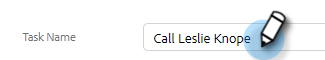

# Créer et affecter des tâches de rappel {#create-and-assign-reminder-tasks}

Les tâches de rappel sont un excellent moyen de rester informé de l’engagement de vos clients et prospects. Pour créer une tâche, procédez comme suit.

1. Cliquez sur **[!UICONTROL Centre de commande]**.

   

1. Les tâches s’ouvrent par défaut. Cliquez sur **[!UICONTROL Ajouter une tâche]**.

   

1. Sélectionnez le type de tâche parmi [!UICONTROL E-mail], [!UICONTROL Appel], [!UICONTROL InMail] ou [!UICONTROL Tâche personnalisée].

   

1. Attribuez un nom à la tâche.

   

1. Choisissez de garder la tâche affectée à vous-même ou sélectionnez un autre utilisateur à qui affecter votre tâche.

   

1. Ajoutez la personne avec laquelle vous effectuez le suivi, avec cette tâche de rappel.

   

1. Sélectionnez la date d’échéance de la tâche.

   

1. Sélectionnez la priorité de la tâche.

   

1. Ajoutez des détails sur la tâche que vous souhaitez mettre à votre disposition lorsque vous l’exécutez, comme des notes d’appel, un modèle de message InMail ou même des notes sur la personne. Cliquez sur **[!UICONTROL Créer]** lorsque vous avez terminé.

   
