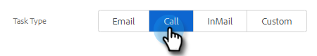

# Création et attribution de tâches de rappel {#create-and-assign-reminder-tasks}

Les tâches de rappel sont un excellent moyen de rester en tête de votre engagement client et prospect. Pour créer une tâche, procédez comme suit.

1. Cliquez sur **Centre de commandes**.

   

1. Les tâches s’ouvrent par défaut. Cliquez sur **Ajouter une tâche**.

   

1. Sélectionnez le type de tâche dans Email, Call, InMail ou Custom Task.

   

1. Attribuez un nom à la tâche.

   

1. Choisissez de conserver la tâche qui vous a été assignée ou de sélectionner un autre utilisateur auquel affecter la tâche.

   

1. Ajoutez la personne que vous suivez, avec cette tâche de rappel.

   

1. Sélectionnez la date d’échéance de la tâche.

   

1. Sélectionnez la priorité de la tâche.

   

1. Ajoutez tous les détails de la tâche que vous souhaitez mettre à votre disposition lors de l’exécution de la tâche, tels que des notes vocales d’appel, un modèle de message InMail ou même des notes sur la personne. Cliquez sur **Créer** une fois terminé.

   
