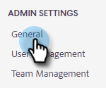

# Domaines bloqués {#blocked-domains}

Aidez votre équipe de vente à réussir en l&#39;empêchant d&#39;envoyer accidentellement des e-mails à des concurrents, des pièges à spam connus ou tout autre domaine que vous ne souhaitez pas contacter.

>[!NOTE]
>
>**Autorisations d’administration requises**

1. Dans l’application web, cliquez sur l’icône d’engrenage et sélectionnez **[!UICONTROL Paramètres]**.

   

1. Sous [!UICONTROL Paramètres d’administration], cliquez sur **[!UICONTROL Général]**.

   

1. Saisissez le domaine à bloquer et cliquez sur **[!UICONTROL Bloquer le domaine]**.

   

   >[!NOTE]
   >
   >Les e-mails faisant partie d’un groupe dont l’envoi échoue en raison de leur envoi à un domaine de messagerie bloqué échouent en silence et n’apparaissent pas dans le dossier des e-mails en échec.
