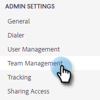
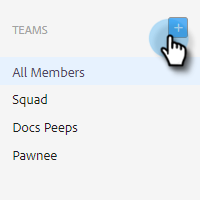
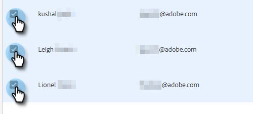

# Création d’une équipe {#creating-a-team}

La création d’une équipe vous permet d’assembler un groupe d’utilisateurs avec lequel le contenu peut être partagé et les rapports peuvent être filtrés par .

## Création d’une équipe {#create-a-team}

1. Dans l’[application web](https://toutapp.com/login), cliquez sur l’icône d’engrenage et sélectionnez **[!UICONTROL Paramètres]**.

   

1. Sous [!UICONTROL Paramètres d’administration], sélectionnez **[!UICONTROL Gestion de l’équipe]**.

   

1. En regard de [!UICONTROL Équipes], cliquez sur l’icône **+**.

   

1. Saisissez un nom d’équipe et cliquez sur **[!UICONTROL Créer]**.

   

>[!NOTE]
>
>Vous pouvez désormais partager des modèles, des campagnes et des groupes avec cette équipe.

## Ajouter des personnes à une équipe {#add-people-to-a-team}

1. Toujours en [!UICONTROL Gestion de l’équipe], sélectionnez **[!UICONTROL Tous les membres]**.

   

1. Recherchez les utilisateurs que vous souhaitez ajouter à votre équipe et cochez leur case.

   

1. Cliquez sur **[!UICONTROL Ajouter aux équipes]**.

   

1. Cliquez sur la liste déroulante et sélectionnez la ou les équipes de votre choix.

   

1. Cliquez sur **[!UICONTROL Ajouter]** lorsque vous avez terminé.

   
