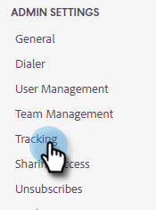

# Comment configurer le suivi de domaine personnalisé {#how-to-set-up-custom-domain-tracking}

Le suivi de domaine personnalisé permet à votre équipe d’utiliser le nom de votre société dans tous les liens trackables ajoutés à vos e-mails de vente. Une fois cette configuration effectuée, nous placerons sur la liste autorisée tout lien présent dans votre e-mail pour qu’il apparaisse sous la forme go.yourcompany.com, de sorte que lorsqu’une personne survole un lien, il indique go.yourcompany.com au lieu de go.toutapp.com.

Vous aurez besoin de l’aide de votre équipe informatique pour configurer un enregistrement CNAME pour votre domaine qui pointe vers go.toutapp.com. Ce CNAME correspond à ce qui apparaît sur tous vos liens de suivi (par exemple, go.yourcompany.com).

Une fois que vous avez confirmé auprès de votre équipe informatique que le CNAME est correctement configuré, vous pouvez l’ajouter à la page [!UICONTROL Suivi de domaine personnalisé] dans Actions.

>[!NOTE]
>
>Si votre CNAME n’est pas configuré correctement et que vous l’activez en tant que domaine personnalisé dans les actions, il peut rompre les liens de suivi et les pixels.

## Activer le suivi de domaine personnalisé {#enable-custom-domain-tracking}

>[!NOTE]
>
>**Privilèges d’administrateur requis.**

1. Cliquez sur l’icône d’engrenage et sélectionnez **[!UICONTROL Paramètres]**.

   

1. Sous [!UICONTROL Paramètres d’administration], sélectionnez **[!UICONTROL Tracking]**.

   

1. Dans l’onglet [!UICONTROL Custom Domain Tracking] , saisissez votre CNAME et cliquez sur **[!UICONTROL Connect]**.

   
