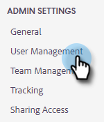

# Inviter des utilisateurs et des administrateurs {#invite-users-and-admins}

Ajouter des utilisateurs ou des administrateurs est simple et rapide !

## Inviter des utilisateurs {#invite-users}

1. Cliquez sur l’icône d’engrenage et sélectionnez **[!UICONTROL Paramètres]**.

   

1. Sous [!UICONTROL Paramètres d’administration], sélectionnez **[!UICONTROL Gestion des utilisateurs]**.

   

1. Cliquez sur le bouton **[!UICONTROL Actions]** et sélectionnez **[!UICONTROL Inviter des utilisateurs]**.

   

   >[!NOTE]
   >
   >Vous pouvez également sélectionner **[!UICONTROL Inviter des utilisateurs au moyen d’un fichier CSV]** si tous les utilisateurs sont répertoriés dans une feuille de calcul.

1. Saisissez les adresses e-mail des personnes que vous souhaitez ajouter.

   

1. ÉTAPE FACULTATIVE : ajoutez le ou les utilisateurs aux équipes dont ils doivent faire partie. Si vous ignorez cette partie, tous les nouveaux membres seront ajoutés à l’équipe Tout le monde.

   

   >[!NOTE]
   >
   >[En savoir plus sur les équipes](/help/marketo/product-docs/marketo-sales-insight/actions/admin/creating-a-team.md).

1. Sélectionnez l’espace de travail Marketo auquel vous souhaitez ajouter le ou les nouveaux utilisateurs. Si vous n’avez qu’un seul espace de travail, vous verrez « Par défaut » comme option. Cliquez sur **Inviter**.

   

1. Cliquez sur **[!UICONTROL OK]**.

   

## Faire d’un utilisateur un administrateur {#make-a-user-an-admin}

>[!NOTE]
>
>**Autorisations d’administrateur requises**

Pour faire d’un utilisateur existant un administrateur, procédez comme suit.

1. Cliquez sur l’icône d’engrenage et sélectionnez **[!UICONTROL Paramètres]**.

   

1. Sous [!UICONTROL Paramètres d’administration], sélectionnez **[!UICONTROL Gestion des utilisateurs]**.

   

1. Recherchez l’utilisateur que vous souhaitez nommer administrateur, cliquez sur le menu déroulant Rôle, puis sélectionnez **[!UICONTROL Administrateur]**.

   

C&#39;est aussi simple que ça !
