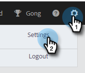
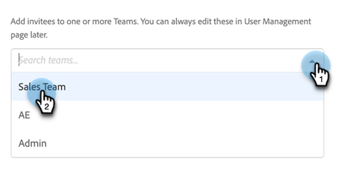

# Invitation d’utilisateurs et d’administrateurs {#invite-users-and-admins}

L’ajout d’utilisateurs ou d’administrateurs est rapide et facile !

## Inviter des utilisateurs {#invite-users}

1. Cliquez sur l’icône d’engrenage et sélectionnez **Paramètres**.

   

1. Sous Paramètres d’administration, sélectionnez **Gestion utilisateur**.

   

1. Cliquez sur le bouton **Actions** et sélectionnez **Inviter des utilisateurs**.

   

   >[!NOTE]
   >
   >Vous pouvez également sélectionner **Inviter des utilisateurs via CSV** si vous les avez tous répertoriés dans une feuille de calcul.

1. Saisissez les adresses électroniques des individus que vous souhaitez ajouter.

   

1. ÉTAPE FACULTATIVE : Ajoutez le ou les utilisateurs à la ou les équipes auxquelles ils doivent faire partie. Si vous ignorez cette partie, tous les nouveaux membres seront ajoutés à l’équipe Tout le monde.

   

   >[!NOTE]
   >
   >[En savoir plus sur les équipes](/help/marketo/product-docs/marketo-sales-insight/actions/admin/creating-a-team.md).

1. Sélectionnez l’espace de travail Marketo auquel vous souhaitez ajouter le ou les nouveaux utilisateurs. Si vous ne disposez que d’un seul espace de travail, vous verrez &quot;Par défaut&quot; comme option. Cliquez sur **Invitation**.

   

1. Cliquez sur **OK**.

   

## Définition d’un utilisateur comme administrateur {#make-a-user-an-admin}

>[!NOTE]
>
>**Autorisations d’administrateur requises**

Pour transformer un utilisateur existant en administrateur, procédez comme suit.

1. Cliquez sur l’icône d’engrenage et sélectionnez **Paramètres**.

   

1. Sous Paramètres d’administration, sélectionnez **Gestion utilisateur**.

   

1. Recherchez l’utilisateur que vous souhaitez créer en tant qu’administrateur, cliquez sur la liste déroulante Rôle et sélectionnez **Admin**.

   

C&#39;est aussi simple que ça !
