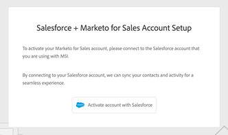

# Paramètres de gestion de la connexion {#login-management-settings}

Les paramètres de gestion de la connexion permettent aux administrateurs de définir les préférences d’authentification pour les utilisateurs des actions Sales Insight à un niveau global.

>[!NOTE]
>
>Par défaut, l’option Salesforce uniquement est sélectionnée pour les instances d’actions Sales Insight. Nous recommandons ce paramètre afin que les utilisateurs puissent [se connecter automatiquement](/help/marketo/product-docs/marketo-sales-insight/actions/admin/auto-login-from-salesforce.md) à partir de Salesforce.

## Mise à jour des paramètres de gestion de la connexion {#update-login-management-settings}

>[!NOTE]
>
>**Autorisations d’administrateur requises**

Pour mettre à jour vos préférences de gestion de connexion, procédez comme suit.

1. Cliquez sur l’icône d’engrenage et sélectionnez **Paramètres**.

   

1. Sous Paramètres d’administration, cliquez sur **Général**.

   

1. Faites défiler l’écran jusqu’à la carte Gestion de connexion et sélectionnez le paramètre souhaité (dans cet exemple, nous choisissons Salesforce uniquement). Cliquez sur **Enregistrer** lorsque vous avez terminé.

   

## FAQ sur Salesforce uniquement {#salesforce-only-faq}

Salesforce uniquement signifie que les utilisateurs peuvent uniquement s’authentifier pour utiliser les actions Sales Insight avec Salesforce. Il s’agit de la sélection par défaut pour les instances d’actions Sales Insight. Elle est recommandée en raison de sa capacité à permettre aux utilisateurs de s’authentifier de manière transparente sans avoir à gérer un nom d’utilisateur et un mot de passe.

### Comment un nouvel utilisateur de mon instance active-t-il son compte lorsque &quot;Salesforce uniquement&quot; est sélectionné ? {#activate-when-salesforce-only-is-selected}

Lorsque vous cliquez sur le bouton **Prise en main** dans le courrier électronique d’invitation, les nouveaux utilisateurs sont envoyés vers l’écran d’activation d’un compte, où ils devront se connecter à leur instance Salesforce pour activer leur compte d’actions de statistiques sur les ventes.

### Avec quelles méthodes d’authentification mes utilisateurs sont-ils autorisés à s’authentifier lorsque &quot;Salesforce uniquement&quot; est sélectionné ? {#what-authentication-methods}

Lorsque vous accédez à notre écran de connexion, les utilisateurs saisissent d’abord leur adresse électronique. Ils cliqueront ensuite sur le bouton Salesforce One Click Login (Connexion un clic), où ils pourront s’authentifier à l’aide du compte Salesforce auquel ils sont connectés.

>[!NOTE]
>
>Cela concerne uniquement les utilisateurs qui accèdent directement à l’écran de connexion. Les utilisateurs qui accèdent aux actions à partir de Salesforce seront connectés à l’aide de l’option [Connexion automatique](/help/marketo/product-docs/marketo-sales-insight/actions/admin/auto-login-from-salesforce.md).

### Comment l’authentification de l’utilisateur est-elle gérée pour les actions lorsqu’un utilisateur accède à une fonction Actions à partir de Salesforce et que &quot;Salesforce uniquement&quot; est sélectionné ? {#how-is-user-authentication-handled}

Lorsqu’un utilisateur clique sur l’une des actions (Appel, Email, Campagne, Tâches, Liste des campagnes, etc..), nous utilisons son authentification SFDC pour le connecter automatiquement à son compte d’actions de statistiques sur les ventes. Nous appelons cette authentification [Connexion automatique](/help/marketo/product-docs/marketo-sales-insight/actions/admin/auto-login-from-salesforce.md).

## FAQ sur toutes les méthodes de connexion {#all-login-methods-faq}

### Comment un nouvel utilisateur de mon instance active-t-il son compte lorsqu’il sélectionne &quot;Toutes les méthodes de connexion&quot; ? {#activate-when-all-login-methods-is-selected}

Lorsqu’un nouvel utilisateur est invité à rejoindre une instance, il reçoit un courrier électronique d’activation de compte. Ils cliqueront sur le bouton &quot;Commencer&quot; qui les mènera alors à une page leur demandant de créer et confirmer un mot de passe. Une fois créés, leur compte sera activé et ils seront pris en charge via le workflow d’intégration.

### Avec quoi les utilisateurs de mon instance sont-ils autorisés à se connecter lorsque l’option &quot;Toutes les méthodes de connexion&quot; est sélectionnée ? {#what-are-users-allowed-to-log-in-with-all-login}

Lorsque vous utilisez notre page de connexion, les utilisateurs saisissent d’abord leur adresse électronique. Ils seront ensuite envoyés sur une page qui leur donne toutes les options de connexion (nom d’utilisateur/mot de passe, SFDC, Gmail, SSO) avec lesquelles s’authentifier.
