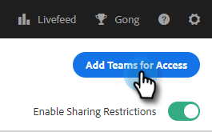

# Paramètres de partage {#sharing-settings}

Gérez mieux vos modèles en limitant les éléments que les utilisateurs peuvent partager et avec quelles catégories.

Lors de la création initiale de votre compte Actions de Ventes Insight, les paramètres de partage sont activés. Cela donne aux administrateurs de votre compte la possibilité de créer et d’organiser vos catégories de modèles avant d’ouvrir les vannes et de permettre aux utilisateurs de partager du contenu dans les catégories de votre équipe.

Lorsque les paramètres de partage sont activés, seuls les administrateurs peuvent partager dans des catégories, sauf si des privilèges de partage sont fournis à une équipe ou à tout le monde. Lorsque les paramètres de partage sont désactivés, il n’existe aucune restriction et tous les utilisateurs peuvent partager dans n’importe quelle catégorie de modèles.

## Configurer Vos Paramètres De Partage {#configure-your-sharing-settings}

1. Dans l’[application web](https://toutapp.com/login), cliquez sur l’icône d’engrenage et sélectionnez **[!UICONTROL Paramètres]**.

   

1. Sous [!UICONTROL Paramètres d’administration], sélectionnez **[!UICONTROL Partage de l’accès]**.

   

1. Assurez-vous que **[!UICONTROL Paramètres de partage]** est activé. Cela signifie que, par défaut, seuls les administrateurs pourront partager des modèles dans vos catégories de modèles.

   

1. Sélectionnez la catégorie de modèle à configurer.

   

1. Cliquez sur **[!UICONTROL Ajouter des équipes pour accéder]**.

   

1. Sélectionnez les équipes que vous souhaitez ajouter.

   

   >[!NOTE]
   >
   >Si vous ne voyez aucune équipe, vous devez accéder à la gestion des équipes et créer une équipe d’utilisateurs.

1. Cliquez sur **[!UICONTROL Ajouter des équipes pour l’accès]** pour enregistrer.

   

1. Maintenant que votre équipe a été ajoutée, vous pouvez choisir d’autoriser uniquement les administrateurs de l’équipe à partager ou tous les utilisateurs de cette équipe. Dans cet exemple, nous donnons à tous les utilisateurs de l’équipe SDR un accès en partage.

   
