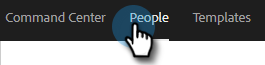

# Ajouter à la campagne marketing {#add-to-marketing-campaign}

>[!PREREQUISITES]
>
>[Rendre une campagne visible pour les utilisateurs de vente](/help/marketo/product-docs/marketo-sales-insight/actions/marketo/make-a-campaign-visible-to-sales-connect-users.md)

## Ajout de personnes à une campagne {#add-individuals-to-a-campaign}

>[!NOTE]
>
>Pour ajouter une personne à une campagne Marketo à partir de Sales Connect, Sales Connect doit avoir l’ID de prospect Marketo de la personne.

1. Cliquez sur l&#39;onglet **Personnes** .

   

1. Recherchez le ou les contacts que vous souhaitez ajouter.

   

1. Cochez la case pour sélectionner votre ou vos contacts, puis cliquez sur **Ajouter la sélection à Campaign**.

   

1. ÉTAPE ICI

   

1. Puisque vous ajoutez à une campagne marketing, ignorez la sélection d’une adresse &quot;de&quot;. Vous pouvez toutefois choisir d&#39;ajouter d&#39;autres contacts. Si vous le souhaitez, cliquez sur Particuliers et saisissez-les. Cliquez sur **Suivant** une fois terminé.

   

1. Cliquez sur **Campagne marketing**.

PICC

1. Cliquez sur la liste déroulante Espaces de travail et sélectionnez l&#39;espace de travail contenant l&#39;opération à laquelle vous souhaitez ajouter le groupe.

PICC

>[!NOTE]
>
>Si vous ne voyez pas l’espace de travail que vous souhaitez, assurez-vous que l’administrateur le configure via la page Accès à l’équipe Marketo .

1. Sélectionnez la campagne souhaitée et cliquez sur **Suivant**.

PICC

1. Les contacts qui remplissent les critères s&#39;affichent. Cliquez sur **Démarrer** pour les ajouter.

PICC

## Ajout d’un groupe à une campagne {#add-a-group-to-a-campaign}

1. Cliquez sur l&#39;onglet **Personnes** .

PICC

1. Sous Mes groupes, sélectionnez le groupe que vous souhaitez ajouter à une campagne.

PICC

1. Cliquez sur **Ajouter un groupe à Campaign**.

PICC

1. Puisque vous ajoutez à une campagne marketing, ignorez la sélection d’une adresse &quot;de&quot;. Vous pouvez toutefois choisir d&#39;ajouter d&#39;autres contacts. Si vous le souhaitez, cliquez sur Particuliers et saisissez-les. Cliquez sur **Suivant** une fois terminé.

PICC

1. Sélectionnez **Campagne marketing**.

PICC

>[!NOTE]
>
>Pour ajouter une personne à une campagne Marketo à partir de Sales Connect, Sales Connect doit avoir l’ID de prospect Marketo de la personne.

1. Cliquez sur la liste déroulante Espaces de travail et sélectionnez l&#39;espace de travail contenant l&#39;opération à laquelle vous souhaitez ajouter le groupe.

PICC

>[!NOTE]
>
>Si vous ne voyez pas l’espace de travail que vous souhaitez, assurez-vous que l’administrateur le configure via la page Accès à l’équipe Marketo .

1. Sélectionnez la campagne souhaitée et cliquez sur **Suivant**.

PICC

1. Les contacts qui remplissent les critères s&#39;affichent. Cliquez sur **Démarrer** pour les ajouter.

PICC
