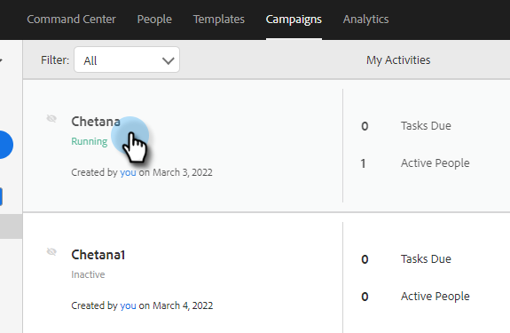

# Paramètres de campagne de ventes {#sales-campaign-settings}

La section Paramètres de campagne de ventes vous permet de configurer une campagne de ventes spécifique afin qu’elle puisse fonctionner de la manière la plus adaptée aux cas d’utilisation de votre équipe pour cette campagne de ventes.

## Ignorer les week-ends {#skip-weekends}

Activez l’option Ignorer les week-ends afin que toutes les étapes qui auraient été exécutées un jour du week-end (samedi ou dimanche) soient déplacées vers le lundi.

>[!NOTE]
>
>Lorsque les week-ends ignorés sont activés, les emails sont planifiés sur la base d’une semaine de 5 jours. En d’autres termes, lorsqu’une étape est planifiée, les week-ends sont ignorés comme des jours.

1. Cliquez sur **Campagnes**.

   

1. Choisissez la campagne de ventes souhaitée.

   

1. Cliquez sur l’onglet **Paramètres** .

   

1. Cochez la case **Ignorer les week-ends** .

   

## Supprimer lors du rebond {#remove-on-bounce}

Si vous utilisez la connexion par e-mail, nous détecterons les rebonds en fonction du message rebond envoyé à la boîte de réception des utilisateurs. De plus, nous pouvons supprimer des personnes des campagnes de ventes lorsqu’un rebond est détecté.

1. Cliquez sur **Campagnes**.

   

1. Choisissez la campagne de ventes souhaitée.

   

1. Cliquez sur l’onglet **Paramètres** .

   

1. Cochez la case **Supprimer lors du rebond** .

   

## En cas de réponse {#if-a-reply-occurs}

Si le suivi des réponses est activé pour Gmail ou Exchange, nous pouvons automatiquement mettre fin à votre campagne de ventes si un destinataire répond à votre email.

1. Cliquez sur **Campagnes**.

   

1. Choisissez la campagne de ventes souhaitée.

   

1. Cliquez sur l’onglet **Paramètres** .

   

1. Sous **Si une réponse se produit**, effectuez la sélection souhaitée.

   

>[!MORELIKETHIS]
>
>* [Créer une campagne de ventes](/help/marketo/product-docs/marketo-sales-insight/actions/campaigns/create-a-sales-campaign.md){target="_blank"}
>* [Comprendre les options d’envoi de campagne de ventes pour les étapes de courrier électronique](/help/marketo/product-docs/marketo-sales-insight/actions/campaigns/understanding-sales-campaign-send-options-for-email-steps.md){target="_blank"}
>* [ Types d’étape de campagne commerciale et tâches de rappel ](/help/marketo/product-docs/marketo-sales-insight/actions/campaigns/sales-campaign-step-types-and-reminder-tasks.md){target="_blank"}
