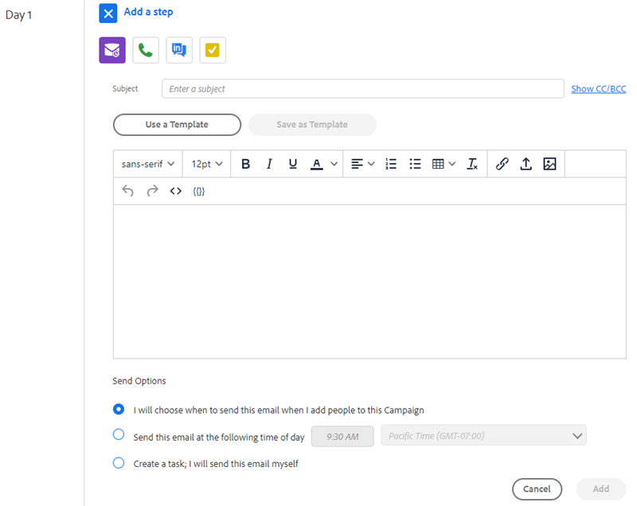

# Types d’étape de campagne de vente et tâches de rappel {#sales-campaign-step-types-and-reminder-tasks}

## Types d’étape de campagne de ventes {#sales-campaign-step-types}

Vous disposez de quatre options lorsque vous ajoutez une étape à votre campagne.

### Adresse e-mail {#email}

Composez un nouvel email ou utilisez un modèle préexistant.

| **Utiliser un modèle** | Sélectionnez l’un de vos modèles préexistants. |
|---|---|
| **Enregistrer comme modèle** | Enregistrez l&#39;email que vous venez de composer en tant que nouveau modèle. |
| **Ajouter du contenu** | Téléchargez un fichier sur notre serveur et recevez une URL (pointant vers le contenu) qui peut être trackée dans votre email. |
| **Joindre des fichiers** | Joindre un fichier de votre ordinateur au courrier électronique (taille maximale de 23 Mo) |

>[!TIP]
>
>En savoir plus sur votre [options d’envoi](/help/marketo/product-docs/marketo-sales-insight/actions/campaigns/sales-campaign-send-options-for-email-steps.md){target=&quot;_blank&quot;}.

### Appelez {#call}

Rappel pour le suivi d&#39;un contact par téléphone. Vous pouvez également enregistrer des notes à utiliser comme suivi de conversation pendant l’appel.

### Message interne {#inmail}

Le suivi sur plusieurs canaux est un excellent moyen de se connecter aux pistes. Avec les tâches InMail, vous pouvez configurer un rappel pour atteindre l’utilisateur via LinkedIn.

### Tâche personnalisée {#custom-task}

Utilisez des tâches personnalisées lorsque les options ci-dessus ne sont pas applicables. Par exemple, vous pouvez inviter un collègue à effectuer un suivi avec une piste par email.

## Utilisation des tâches de rappel dans les campagnes {#using-reminder-tasks-in-campaigns}

Les tâches constituent un outil puissant lors de l’envoi d’une campagne à un contact, en particulier si votre processus de vente est multicanal/tactile.

Les tâches d’envoi d’un courrier électronique et la tâche d’appel d’un contact sont les utilisations les plus courantes des tâches dans les campagnes.

Vous pouvez également créer une &quot;tâche à envoyer&quot; avec un contact sur LinkedIn si cela fait partie de votre workflow. Vous pouvez également effectuer une tâche personnalisée afin de vous rappeler de les inviter à une heure heureuse, de leur demander un événement caritatif, ou de vous enregistrer après le match 5, etc.

>[!NOTE]
>
>Ce qui est le plus important à propos des tâches dans les campagnes, c’est que vous devez terminer la tâche pour déclencher l’étape suivante.

Les tâches seront toujours associées à chaque individu de la campagne. Cela signifie que vous devez entrer en contact avec chaque personne et fermer la tâche pour que sa campagne individuelle se poursuive.

Vous pouvez gérer vos tâches dans : l’onglet Tâches de votre campagne dans Campaign 2.0, directement depuis votre centre de commandes ou la section Tâches du flux en direct. Vous pouvez également gérer vos tâches à partir de Salesforce.

>[!MORELIKETHIS]
>
>[Créer une campagne de ventes](/help/marketo/product-docs/marketo-sales-insight/actions/campaigns/create-a-sales-campaign.md){target=&quot;_blank&quot;}
