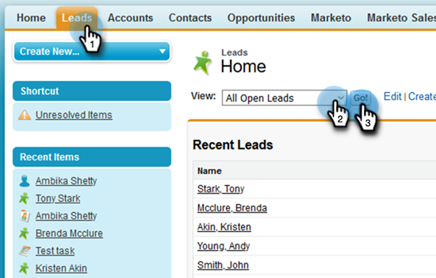

# Utilisation de l’ajout en bloc à la campagne de ventes dans Salesforce {#using-bulk-add-to-sales-campaign-in-salesforce}

Découvrez comment ajouter en bloc des à des campagnes de vente dans Salesforce pour adapter votre communication sortante à l’aide d’actions de vente.

>[!NOTE]
>
>Salesforce applique une limite de 200 enregistrements pouvant être sélectionnés à la fois.

>[!PREREQUISITES]
>
>Assurez-vous d’avoir installé le [dernier package Sales Insight](/help/marketo/product-docs/marketo-sales-insight/msi-for-salesforce/upgrading/upgrading-your-msi-package.md){target="_blank"} sur votre instance Salesforce et d’avoir configuré les [ boutons d’action](/help/marketo/product-docs/marketo-sales-insight/actions/crm/salesforce-package-configuration/add-action-buttons-to-salesforce-list-view.md){target="_blank"} dans les vues de liste de contacts et de leads dans Salesforce.

## Ajout en bloc à la campagne de ventes dans Salesforce Lightning {#bulk-add-to-sales-campaign-in-salesforce-lightning}

1. Dans Salesforce, accédez à la page d’accueil Leads/Contacts en cliquant sur l’onglet **Leads/Contacts**.

   

1. Dans la liste déroulante **Affichage**, sélectionnez l’affichage souhaité des prospects/contacts à envoyer par e-mail.

   >[!TIP]
   >
   >Vous pouvez créer une nouvelle vue en cliquant sur l’icône représentant un engrenage à droite et en sélectionnant **Nouveau**. Une fois que vous avez donné un nouveau nom à la vue et que vous l’avez enregistrée, vous pouvez cliquer sur l’icône de filtre à droite pour filtrer l’ensemble de prospects/contacts que vous souhaitez envoyer par e-mail.

1. Choisissez la liste de leads ou de contacts de votre choix, puis cliquez sur le bouton **Ajouter à la campagne de ventes**.

   

1. Vous accédez à la fenêtre modale Actions - Campagne de ventes , avec les destinataires que vous avez sélectionnés ajoutés.

1. Apportez les modifications nécessaires pour supprimer des personnes ou des groupes, puis cliquez sur **Suivant**.

   

1. Sélectionnez la catégorie de campagne de ventes à utiliser dans la liste déroulante Catégories.

1. Sélectionnez la campagne de ventes à laquelle vous souhaitez ajouter les personnes sélectionnées et cliquez sur **Suivant**.

   

1. Différentes options peuvent s’afficher en fonction de la première étape de votre campagne. Si votre première étape est un e-mail, vous aurez la possibilité de modifier l’e-mail de chaque destinataire, comme illustré ci-dessous. Cliquez ensuite sur **Suivant**.

   

1. Encore une fois, si votre première étape est un e-mail et que vous l’avez configuré pour vous permettre de sélectionner le moment du lancement de la campagne, vous aurez la possibilité de **Démarrer maintenant** ou **Planifier une nouvelle heure de début**. Une fois cette opération terminée, cliquez sur **Démarrer**.

   

Après avoir cliqué sur Démarrer, un écran de confirmation s’affiche pour vous informer du nombre de personnes ajoutées.

## Ajout en bloc à la campagne de ventes dans Salesforce Classic {#bulk-add-to-sales-campaign-in-salesforce-classic}

1. Dans Salesforce, cliquez sur l’onglet **Leads/contacts**.

1. Dans la liste déroulante Affichage , sélectionnez l’affichage des prospects/contacts à envoyer par e-mail, puis cliquez sur **Aller**.

   

   >[!TIP]
   >
   >Vous pouvez créer une nouvelle vue en cliquant sur Créer une nouvelle vue et en configurant les filtres disponibles pour réduire la liste des destinataires que vous enverrez par e-mail.

1. Choisissez la liste de leads ou de contacts de votre choix, puis cliquez sur le bouton **Ajouter à la campagne de ventes**.

   

1. Vous accédez à la fenêtre modale Actions - Campagne de ventes avec les personnes que vous avez sélectionnées ajoutées.

1. Apportez les modifications nécessaires pour supprimer des personnes ou des groupes, puis cliquez sur **Suivant**.

   

1. Sélectionnez la catégorie de campagne de ventes à utiliser dans la liste déroulante **Catégories**.

1. Sélectionnez la campagne de ventes à laquelle vous souhaitez ajouter les personnes sélectionnées et cliquez sur **Suivant**.

   

1. Différentes options peuvent s’afficher en fonction de la première étape de votre campagne. Si votre première étape est un e-mail, vous aurez la possibilité de modifier l’e-mail de chaque destinataire, comme illustré ci-dessous. Cliquez ensuite sur **Suivant**.

   

1. Encore une fois, si votre première étape est un e-mail et que vous l’avez configuré pour vous permettre de sélectionner le moment du lancement de la campagne, vous aurez la possibilité de **Démarrer maintenant** ou **Planifier une nouvelle heure de début**. Une fois cette opération terminée, cliquez sur **Démarrer**.

   

Après avoir cliqué sur Démarrer, un écran de confirmation s’affiche pour vous informer du nombre de personnes ajoutées.

