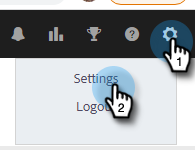

# Connecter votre compte [!DNL Sales Insight Actions] à [!DNL Salesforce] {#connect-your-sales-insight-actions-account-to-salesforce}

Suivez ces étapes simples pour connecter [!DNL Sales Insight Actions] compte à [!DNL Salesforce].

## Comment se connecter en tant qu’administrateur {#how-to-connect-as-an-admin}

1. Cliquez sur l’icône d’engrenage et sélectionnez **[!UICONTROL Paramètres]**.

   

1. Sous [!UICONTROL Paramètres d’administration], cliquez sur **[!UICONTROL Salesforce]**.

   

1. Dans l’onglet [!UICONTROL Connexions et personnalisations], cliquez sur **[!UICONTROL Salesforce]** puis **[!UICONTROL Connexion]**.

   

1. Cliquez sur **[!UICONTROL OK]**.

   

1. Si vous êtes déjà connecté à Salesforce, vous serez connecté. Si ce n&#39;est pas le cas, on vous demandera de vous connecter.

## Connexion en tant que non-administrateur {#how-to-connect-as-a-non-admin}

1. Cliquez sur l’icône d’engrenage et sélectionnez **[!UICONTROL Paramètres]**.

   

1. Sous [!UICONTROL &#x200B; Mon compte &#x200B;], sélectionnez **[!UICONTROL Salesforce]**.

1. Dans l’onglet [!UICONTROL Connexions et personnalisations], cliquez sur **[!UICONTROL Salesforce]** puis **[!UICONTROL Connexion]**.

   

1. Cliquez sur **[!UICONTROL OK]**.

   

1. Si vous êtes déjà connecté à Salesforce, vous serez connecté. Si ce n&#39;est pas le cas, on vous demandera de vous connecter.
