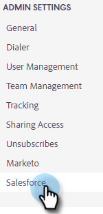

# Déconnecter [!DNL Salesforce] De [!DNL Sales Insight Actions] {#disconnect-salesforce-from-sales-insight-actions}

Parfois, vous devrez peut-être déconnecter votre compte [!DNL Salesforce] de votre compte [!DNL Sales Insight Actions]. Voici comment faire.

## Comment se déconnecter de [!UICONTROL Salesforce] en tant qu&#39;administrateur {#how-to-disconnect-from-salesforce-as-an-admin}

1. Dans [!DNL Sales Insight Actions], cliquez sur l’icône d’engrenage en haut à droite et sélectionnez **[!UICONTROL Paramètres]**.

   

1. Sous [!UICONTROL Paramètres d’administration], cliquez sur **[!UICONTROL Salesforce]**.

   

1. Dans l’onglet [!UICONTROL  Connexions et personnalisations ], cliquez sur **[!UICONTROL Déconnecter]**.

   

## Comment se déconnecter de [!DNL Salesforce] en tant que non-administrateur {#how-to-disconnect-from-salesforce-as-a-non-admin}

1. Dans [!DNL Sales Insight Actions], cliquez sur l’icône d’engrenage en haut à droite et sélectionnez **[!UICONTROL Paramètres]**.

   

1. Sous [!UICONTROL  Mon compte ], sélectionnez **[!UICONTROL Salesforce]**.

PICC

1. Dans l’onglet [!UICONTROL  Connexions et personnalisations ], cliquez sur **[!UICONTROL Déconnecter]**.

PICC
