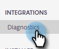

# Diagnostics [!DNL Salesforce] {#salesforce-diagnostics}

Une partie de notre intégration [!DNL Salesforce] comprend une page de diagnostic [!DNL Salesforce] dans l’application web. Cette page capture les erreurs de la journalisation des données ayant échoué dans [!DNL Salesforce]. Les erreurs peuvent s’avérer utiles, mais ne sont pas toujours lisibles. C’est pourquoi nous avons élaboré un aide-mémoire qui permet d’expliquer les messages d’erreur.

## Accéder aux diagnostics {#access-diagnostics}

1. Cliquez sur l’icône d’engrenage et choisissez **[!UICONTROL Paramètres]**.

   

1. Sous [!UICONTROL &#x200B; Intégrations &#x200B;], cliquez sur **[!UICONTROL Diagnostics]**.

   

## Aide-mémoire d’erreur {#error-cheat-sheet}

**Error:** API_CURRENTLY_DISABLED
**Category:** Access/Validation
**Message :** API est désactivée pour cet utilisateur
**Que se passe-t-il** l’utilisateur ne dispose pas d’un accès API ?
**Étapes de dépannage :** l’administrateur [!DNL Salesforce] doit accorder l’accès à l’API utilisateur.

**Error:** AUTHENTICATION_FAILURE
**Category:** Authentification
**Message:** invalid_grant : échec de l’authentification
**Que se passe-t-il** l’authentification a échoué ?
**Étapes de dépannage :** déconnectez-vous d’[!DNL Salesforce], puis reconnectez-vous.

**Error:** CANNOT_INSERT_UPDATE_ACTIVATE_ENTITY
**Category:** Access/Validation
**Message:** {« errorCode »:« INVALID_SESSION_ID »,« message »:« Session expirée ou non valide »}
**Que se passe-t-il**

1 - Le code de déclencheur entraîne l’échec de la mise à jour.
2 - L’utilisateur ne dispose pas d’autorisations d’écriture au niveau de l’objet sur l’objet donné.

**Étapes de dépannage :**

1 - Déclencheur de révision ayant échoué
2 - Accordez à l’utilisateur l’accès en écriture pour l’objet OU désactivez la fonctionnalité qui tente d’écrire dans l’objet.

**Erreur :** CANNOT_UPDATE_CONVERTED_LEAD
**Catégorie :** Autre
**Message :** ne peut pas référencer le prospect converti
**Que se passe-t-il** nous essayons de nous connecter à un prospect converti lors de la journalisation de l’activité la plus récente pour les contacts et les prospects. J&#39;en ai aussi vu quelques-unes pour les emplacements.
**Étapes de dépannage :** signalez tout cas de ce type à notre [équipe d’assistance](https://nation.marketo.com/t5/Support/ct-p/Support).

**Error:** ENTITY_IS_LOCKED
**Category:** Access/Validation
**Message :** l’entité est verrouillée pour modification
**Que se passe-t-il** l’enregistrement est dans un processus d’approbation où il est verrouillé de toute modification supplémentaire jusqu’à ce qu’il soit approuvé ou refusé par une personne propriétaire de l’approbation.
**Étapes de dépannage :** voir ci-dessus.

**Error:** EXPIRED_ACCESS
**Category:** Authentification
**Message:** invalid_grant : jeton d’accès/d’actualisation expiré
**Que se passe-t-il** le jeton d’accès ou d’actualisation a expiré ? Les jetons expirent en fonction des paramètres de session [ dans  [!DNL Salesforce]](https://salesforce.stackexchange.com/questions/10759/invalid-grant-expired-access-refresh-token-error-when-authenticating-access-via).
**Étapes de dépannage :** vous devrez vous authentifier à nouveau. Déconnectez la connexion [!DNL Salesforce] et reconnectez-vous.

**Error:** FAILED_WRITE
**Category:** Intermittent
**Message : fin** fichier atteinte
**Que se passe-t-il** problème de performances avec [!DNL Salesforce], probablement dû à des déclencheurs sous-optimaux côté client.
**Étapes de dépannage :** la logique de reprise doit gérer cette situation. Si cela ne fonctionne toujours pas, contactez votre administrateur [!DNL Salesforce] pour résoudre un problème de déclencheur.

**Error:** FIELD_CUSTOM_VALIDATION_EXCEPTION
**Category:** Access/Validation
**Message :** varie d’un client à l’autre.
**Que se passe-t-il** échec d’une règle de validation personnalisée pour l’objet ?
**Étapes de dépannage :** vérifiez la règle de validation personnalisée à l’origine de cette erreur. Comme il s’agit d’une règle personnalisée, l’erreur doit être traitée de manière ponctuelle.

**Error:** FIELD_FILTER_VALIDATION_EXCEPTION
**Category:** Access/Validation
**Message:** La valeur n’existe pas ou ne correspond pas aux critères de filtre
**Que se passe-t-il** les données incorrectes existantes dans [!DNL Salesforce] sont appliquées lors de la mise à jour ?
**Étapes de dépannage :** voir ci-dessus.

**Error:** FIELD_INTEGRITY_EXCEPTION
**Category:** Access/Validation
**Message :** le pays/territoire existant ne reconnaît pas la valeur d’état pour le champ : Code d’état/province
**Que se passe-t-il** les données incorrectes existantes dans [!DNL Salesforce] sont appliquées lors de la mise à jour ?
**Étapes de dépannage :** voir ci-dessus.

**Error:** INACTIVE_ORGANIZATION
**Category:** Authentification
**Message:** invalid_grant: inactive organization
**Que se passe-t-il** votre organisation [!DNL Salesforce] n’est plus active ?
**Étapes de dépannage :** Déconnectez-vous d’[!DNL Salesforce], puis reconnectez-vous.

**Error:** INACTIVE_USER
**Category:** Authentification
**Message:** invalid_grant: inactive user
**Que se passe-t-il** l’utilisateur [!DNL Salesforce] n’est plus actif ?
**Étapes de dépannage :** Déconnectez-vous d’[!DNL Salesforce], puis reconnectez-vous.

**Error:** INSERT_UPDATE_DELETE_NOT_ALLOWED_DURING_MAINTENANCE
**Category:** Intermittent
**Message :** (aucun message supplémentaire)
**Que se passe-t-il** l’instance [!DNL Salesforce] est en mode de maintenance ?
**Étapes de dépannage :** attendez que la maintenance du système soit terminée, puis réessayez de vous connecter.

**Error:** INSUFFISANT_ACCESS_ON_CROSS_REFERENCE_ENTITY
**Category:** Access/Validation
**Message :** droits d&#39;accès insuffisants sur l&#39;ID d&#39;objet
**Que se passe-t-il** pas d’accès à l’enregistrement parent d’une tâche.
**Étapes de dépannage :** voir ci-dessus.

**Error:** INSUFFISANT_ACCESS_OR_READONLY
**Category:** Access/Validation
**Message :** droits d&#39;accès insuffisants sur l&#39;ID d&#39;objet
**Que se passe-t-il** la journalisation de l’activité la plus récente ne peut pas modifier l’enregistrement spécifique, car l’utilisateur ne dispose pas d’un accès en écriture.
**Étapes de dépannage :** accorder à l’utilisateur l’accès dans [!DNL Salesforce] OU désactiver la journalisation de l’activité la plus récente pour cet objet pour cet utilisateur.

**Error:** INVALID_FIELD
**Category:** Intermittent
**Message:** Net::ReadTimeout
**Que se passe-t-il** la requête expire ? Cela est probablement dû à la lenteur excessive des transactions.
**Étapes de dépannage :** passez en revue les personnalisations existantes pour identifier les responsables potentiels des problèmes de latence et/ou désactivez la journalisation de l’activité la plus récente pour un ou tous les objets afin de réduire la charge.

**Error:** INVALID_FIELD_FOR_INSERT_UPDATE
**Category:** Access/Validation
**Message :** impossible de créer/mettre à jour les champs : MSE_Replied__c. Vérifiez les paramètres de sécurité de ce champ.
**Que se passe-t-il** les utilisateurs ne disposent pas d’un accès en écriture aux champs personnalisés des actions Sales Insight nécessaires pour effectuer la transaction de journalisation de l’activité la plus récente ? L’équipe a peut-être installé le package mais n’a pas activé les champs corrects pour les utilisateurs.
**Étapes de dépannage :** l’administrateur [!DNL Salesforce] doit accorder l’accès aux champs personnalisés OU désactiver la journalisation de l’activité la plus récente.

**Error:** INVALID_GRANT
**Category:** Authentification
**Message:** invalid_grant: ip restreint
**Ce qui se passe** nous essayons d’accéder à vos [!DNL Salesforce], mais vous avez mis en place des restrictions en matière de PI qui nous empêchent de le faire.
placer sur la liste autorisée **Étapes de dépannage :** votre administrateur [!DNL Salesforce] devra nos adresses IP. Les utilisateurs doivent contacter le support technique pour obtenir les adresses IP.

**Error:** INVALID_TYPE
**Category:** Access/Validation
**Message:** CreatedDate, (SELECT Id FROM Tasks) FROM Lead WHERE Email=&#39;emailid&#39;^ERROR at `Row:1:Column:53sObject` type &#39;Lead&#39; n’est pas pris en charge. Si vous essayez d’utiliser un objet personnalisé, assurez-vous d’ajouter « __c » après le nom de l’entité. Référencez votre WSDL ou l’appel descriptif pour les noms appropriés
**Que se passe-t-il** Nous tentons d’interroger un type d’objet de Salesforce auquel l’utilisateur n’a pas accès. Cela est probablement dû au fait que l’utilisateur ne dispose pas du droit d’accès à l’objet de lead.
**Étapes de dépannage :** accordez l’accès en lecture et mise à jour à l’objet de prospect dans Salesforce ou désactivez la journalisation des e-mails et la journalisation de l’activité la plus récente pour les enregistrements de prospect.

**Error:** QUERY_TIMEOUT
**Category:** Intermittent
**Message :** votre requête a été exécutée depuis trop longtemps
**Que se passe-t-il** voir ci-dessus ?
**Étapes de dépannage :** la logique de reprise doit gérer cette situation. Si cela ne fonctionne toujours pas, contactez votre administrateur [!DNL Salesforce] pour résoudre un problème de déclencheur.

**Error:** REQUEST_LIMIT_EXCEEDED
**Category:** Intermittent
**Message:**
1 - Limite de ConcurrentPerOrgLongTxn dépassée
2 - Nombre maximal de demandes dépassé
3 - DemandeConcurrente
**Que se passe-t-il**
1 - Limite de demandes simultanées dépassée, probablement en raison d’un code de déclencheur inefficace.
2 - Trop d’intégrations placent l’organisation au-delà de la fenêtre dynamique de 24 heures.
**Étapes de dépannage :**
1 - Examinez les déclencheurs existants sur les objets concernés. Désactivez éventuellement la journalisation cumulée pour un ou plusieurs objets.
2 - Achetez plus d’appels API auprès de [!DNL Salesforce]. Désactivez éventuellement la journalisation cumulée pour un ou plusieurs objets.

**Error:** REQUIRED_FIELD_MISSING
**Category:** Access/Validation
**Message :** champs obligatoires manquants : `[Amount_Committed_Private_Capital__c]`
**Que se passe-t-il** : cela se produit généralement pour la journalisation de l’activité la plus récente. Les champs personnalisés ont été configurés pour être obligatoires, mais contiennent des valeurs vides. Cela peut se produire si l’enregistrement a été créé avec une valeur vide du champ personnalisé, puis rendu obligatoire. Le caractère obligatoire est appliqué lorsque nous tentons de mettre à jour l’enregistrement, même si nous ne touchons pas au champ personnalisé.
**Étapes de dépannage :** mettez à jour manuellement les valeurs des champs manquants. Vous pouvez ensuite réessayer le message à partir des actions Sales Insight.

**Error:** SERVER_UNAVAILABLE
**Category:** Intermittent
**Message :** serveur trop occupé
**Que se passe-t-il** problème de performances avec [!DNL Salesforce], probablement en raison de déclencheurs non optimaux par le client
**Étapes de dépannage :** la logique de reprise doit gérer cette situation. Si cela ne fonctionne toujours pas, contactez votre administrateur [!DNL Salesforce] pour résoudre un problème de déclencheur.

**Error:** TXN_SECURITY_NO_ACCESS
**Category:** Access/Validation
**Message :** l’opération que vous avez demandée n’est pas autorisée en raison d’une politique de sécurité de votre organisation. Contactez votre administrateur.
**Que se passe-t-il** une sorte de restriction de sécurité a été configurée ? Voir https://developer.salesforce.com/forums/?id=« record ID ».
**Étapes de dépannage :** adressez-vous à votre administrateur [!DNL Salesforce] et vérifiez quelle peut être la restriction spécifique.

**Error:** UNABLE_TO_LOCK_ROW
**Category:** Intermittent
**Message :** impossible d’obtenir l’accès exclusif à cet enregistrement ou 1 enregistrement : « ID d’enregistrement »
**Ce qui se passe** : il est probable qu’un déclencheur entraîne plusieurs tentatives d’accès au même enregistrement, éventuellement dans le cas d’un e-mail de groupe.
**Étapes de dépannage :** la logique de reprise doit gérer cette situation. Si cela ne fonctionne toujours pas, contactez votre administrateur [!DNL Salesforce] pour résoudre un problème de déclencheur.

**Error:** UNKNOWN_EXCEPTION
**Catégorie :** Autre
**Message :** exception inconnue s’est produite
**Que se passe-t-il** exception non gérée dans [!DNL Salesforce] ?
**Étapes de dépannage :** enregistrez un dossier avec [!DNL Salesforce] et copiez les valeurs numériques dans le message d’erreur. Il s’agit d’[!DNL Salesforce] code qui ne gère pas correctement une erreur.
