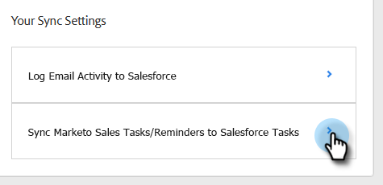

# Synchroniser les activités de vente avec Salesforce {#sync-sales-activities-to-salesforce}

Vous pouvez configurer les Paramètres de synchronisation Salesforce des actions pour consigner les activités d’e-mail et d’appel dans Salesforce. Cela offre une meilleure visibilité aux équipes qui travaillent à partir de votre CRM et permet aux responsables d’utiliser ces activités pour créer des rapports Salesforce personnalisés afin de suivre les performances de vos équipes.

## Journalisation de l’activité E-mail dans Salesforce via l’API {#logging-email-activity-to-salesforce-via-api}

Cette fonctionnalité nécessite que vous utilisiez l’édition Enterprise/Unlimited de Salesforce ou l’édition Professional si vous avez acheté Integration via l’API Web Services.

>[!PREREQUISITES]
>
>Les actions Salesforce et Sales Insight doivent être connectées.

1. Dans Actions de Sales Insight, cliquez sur l’icône d’engrenage et sélectionnez **Paramètres**.

   

1. Sous Paramètres d&#39;administration (ou « Mon compte » si vous n&#39;êtes pas administrateur), cliquez sur **Salesforce**.

   

1. Cliquez sur l’onglet **Paramètres de synchronisation**.

   

1. Cliquez sur la flèche en regard de Consigner l’activité E-mail dans Salesforce.

   

1. Cliquez sur l’onglet **API Salesforce**. Dans cette carte, vous pouvez configurer vos préférences de journalisation des informations dans Salesforce. Cliquez sur **Enregistrer** lorsque vous avez terminé.

   

## Consignation de l’activité E-mail dans Salesforce via E-mail vers Salesforce (Cci) {#logging-email-activity-to-salesforce-via-email-to-salesforce-bcc}

Une fois que vous avez activé « E-mail à Salesforce (Cci) », vous recevez un Cci de vos e-mails de vente et vos e-mails sont consignés en tant qu’activités sur les opportunités, les prospects et les contacts.

>[!PREREQUISITES]
>
>Les actions Salesforce et Sales Insight doivent être connectées.

**Pour consigner vos e-mails dans Salesforce via E-mail (Cci)**

1. Dans Marketo Sales, cliquez sur l’icône d’engrenage et sélectionnez **Paramètres**.

   

1. Sous Paramètres d&#39;administration (ou « Mon compte » si vous n&#39;êtes pas administrateur), cliquez sur **Salesforce**.

   

1. Cliquez sur l’onglet **Paramètres de synchronisation**.

   

1. Cliquez sur l’onglet **E-mail à Salesforce (Cci)** puis sur **Activer**.

   

Si, pour une raison quelconque, votre adresse e-mail à Salesforce n’est pas extraite, procédez comme suit pour activer la fonctionnalité Cci dans votre compte Salesforce :

1. Connectez-vous à votre instance Salesforce.
1. Recherchez votre nom d’utilisateur dans le coin supérieur droit et sélectionnez la barre déroulante.
1. Sélectionnez **Mes paramètres**.
1. Sélectionnez **E-mail**.
1. Sélectionnez **Mon e-mail à Salesforce**.
1. Sur cette page, un champ intitulé « E-mail à l’adresse Salesforce » s’affiche. Si aucun champ n’est renseigné en regard de celui-ci, faites défiler l’écran jusqu’à « Mes adresses électroniques acceptables ».
1. Saisissez la ou les adresses e-mail à utiliser en Cci.
1. Cliquez sur **Enregistrer les modifications**.

**Impossible de trouver mon adresse e-mail à Salesforce dans Mes paramètres**

Si vous ne voyez pas Mon e-mail à Salesforce sous vos paramètres, c’est peut-être que votre administrateur ne l’a pas activé. Cela peut se produire si votre équipe est nouvelle sur Salesforce ou si elle n’a jamais utilisé l’adresse en Cci fournie par Salesforce.

>[!NOTE]
>
>Pour configurer ce paramètre, vous aurez besoin de droits d’administrateur.

1. Cliquez sur **Configurer**.
1. Cliquez sur **Administration des e-mails**.
1. Cliquez sur **Envoyer par e-mail à Salesforce**.
1. Cliquez sur **Modifier**.
1. Cochez la case en regard de « Actif ».
1. Cliquez sur **Enregistrer**

## Synchroniser les tâches/rappels des actions Insight Sales avec les tâches Salesforce {#sync-sales-insight-actions-tasks-reminders-to-salesforce-tasks}

1. Dans Actions de Sales Insight, cliquez sur l’icône d’engrenage et sélectionnez **Paramètres**.

   

1. Sous Paramètres d&#39;administration (ou « Mon compte » si vous n&#39;êtes pas administrateur), cliquez sur **Salesforce**.

   

1. Cliquez sur l’onglet **Paramètres de synchronisation**.

   

1. Cliquez sur la flèche en regard de Synchroniser les tâches commerciales/rappels Marketo avec les tâches Salesforce.

   

1. Sélectionnez l’option souhaitée (l’option « Ne pas synchroniser avec les tâches Salesforce » est sélectionnée par défaut).

   

## Synchronisation des tâches d’actions Sales Insight avec Salesforce pour la première fois {#syncing-sales-insight-ations-tasks-with-salesforce-for-the-first-time}

Lorsque vous activez pour la première fois la synchronisation entre les actions Sales Insight et les tâches Salesforce, nous importons vos tâches Salesforce. Nous ne transmettrons pas à Salesforce les tâches en cours dans les actions Sales Insight. Pour réduire l’encombrement et les doublons, les seules tâches qui sont synchronisées à partir des actions Sales Insight dans Salesforce sont les tâches créées après la synchronisation des actions Sales Insight avec SFDC.

Voici ce qui se produit lorsque vous synchronisez les actions Sales Insight et les tâches SFDC :

* Dès que vous cliquez sur Enregistrer sur les tâches en cours de synchronisation, elles commencent à se synchroniser. Cela prendra un certain temps au début.

* Tous les rappels qui ont été mis à jour ou créés au cours des dernières 24 heures seront extraits de SFDC vers les actions Sales Insight. La synchronisation est basée sur la date d’échéance et toutes ces tâches seront synchronisées en arrière-plan, mais dans le centre de commande, vous ne verrez que les tâches dues aujourd’hui et demain.

* Si la synchronisation a été activée précédemment et que vous supprimez des tâches dans SFDC, tout ce qui a été supprimé au cours des 15 derniers jours sera supprimé du Centre de commande.

* Tant que la synchronisation est activée, nous synchroniserons en permanence les tâches entre les actions Sales Insight et SFDC.

* Après la synchronisation initiale, toutes les tâches que vous créez, modifiez, terminez ou supprimez dans les actions Sales Insight sont synchronisées avec votre liste de tâches dans Salesforce. Et tout ce qui est créé, modifié, terminé ou supprimé dans Salesforce mettra à jour votre liste de tâches dans les actions Sales Insight.

* Pour activer cette synchronisation, cochez simplement la case de synchronisation dans la page Paramètres de l’application web.
