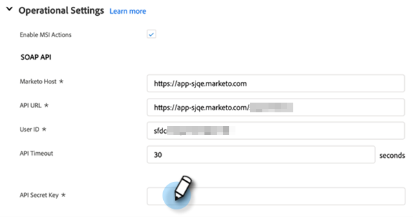

# Configuration de [!DNL Sales Insight Actions] dans [!DNL Salesforce] {#sales-insight-actions-configuration-in-salesforce}

>[!PREREQUISITES]
>
>* [Installer](/help/marketo/product-docs/marketo-sales-insight/msi-for-salesforce/installation/install-marketo-sales-insight-package-in-salesforce-appexchange.md) ou [Mettre à niveau](/help/marketo/product-docs/marketo-sales-insight/msi-for-salesforce/upgrading/upgrading-your-msi-package.md) le package Sales Insight dans votre instance [!DNL Salesforce]
>* [Configuration de Marketo Sales Insight in [!DNL Salesforce] Enterprise/Unlimited](/help/marketo/product-docs/marketo-sales-insight/msi-for-salesforce/configuration/configure-marketo-sales-insight-in-salesforce-enterprise-unlimited.md)

## Ajouter un nouveau site distant dans [!DNL Salesforce] {#add-new-remote-site-in-salesforce}

1. Dans [!DNL Salesforce], cliquez sur **[!UICONTROL Configurer]**.

   

1. Recherchez « [!UICONTROL site distant] » et sélectionnez **[!UICONTROL Paramètres du site distant]**.
   

1. Cliquez sur **[!UICONTROL Nouveau site distant]**.

   

1. Saisissez le nom du site distant (par exemple, « MarketoSalesInsight1 »). Saisissez le `https://ims-na1.adobelogin.com` URL du site distant et cliquez sur **[!UICONTROL Enregistrer]**.

   

1. Cliquez de nouveau sur **[!UICONTROL Nouveau site distant]**.

   

1. Saisissez le nom du site distant (par exemple, « MarketoSalesInsight2 »). Saisissez le `https://mkto-sales-connect.adobe.io` URL du site distant et cliquez sur **[!UICONTROL Enregistrer]**.

## Activation des [!DNL Sales Insight Actions] dans le CRM {#enabling-sales-insight-actions-across-the-crm}

1. Dans [!DNL Salesforce], cliquez sur l’onglet **[!UICONTROL Configuration Marketo Sales Insight]**.

   

   >[!NOTE]
   >
   >Si vous ne voyez pas « [!UICONTROL Marketo Sales Insight Config] » dans votre barre supérieure, cliquez sur le signe **+** et recherchez-le sous Tous les onglets.

1. Cochez la case **[!UICONTROL Activer les actions MSI]**.

   

1. Saisissez la [!UICONTROL  Clé secrète API ].

   

   >[!NOTE]
   >
   >Si vous n’avez pas à portée de main votre [!UICONTROL clé secrète API], vous pouvez la trouver en suivant les étapes décrites dans [cet article](/help/marketo/product-docs/marketo-sales-insight/msi-for-salesforce/configuration/configure-marketo-sales-insight-in-salesforce-enterprise-unlimited.md).

1. Cliquez sur **[!UICONTROL Enregistrer]** lorsque vous avez terminé.

Cela active automatiquement toutes les fonctionnalités d&#39;actions MSI décrites dans l&#39;article de présentation des fonctionnalités.

>[!NOTE]
>
>Vous pouvez désactiver toutes les fonctions MSI Actions en décochant simplement la case « Activer les actions MSI ».

## Gouvernance des MSI-Actions {#msi-actions-governance}

1. Vous pouvez désactiver les campagnes de vente et/ou l’onglet Tâche dans la section à venir. Cela s’appliquera aux panneaux de prospect, de contact, de compte et d’opportunité.

   

1. Vous pouvez désactiver les actions MSI en décochant les fonctions correspondantes sous [!UICONTROL Paramètres des actions].

   

>[!NOTE]
>
>Les paramètres de gouvernance s&#39;appliquent à tous les utilisateurs de MSI.
