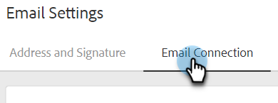

# Connexion à Gmail {#connect-to-gmail}

La connexion à Gmail signifie que vous recevrez le suivi des réponses, l’accès au canal de diffusion Gmail, la possibilité de planifier des emails dans Gmail et d’envoyer la conformité.

>[!CAUTION]
>
>Si vous [utilisez des filtres](https://support.google.com/mail/answer/6579?hl=en#zippy=%2Ccreate-a-filter%2Cedit-or-delete-filters){target="_blank"} ou des règles dans votre compte Gmail pour marquer automatiquement les emails comme lus, cela peut entraîner des problèmes avec le suivi des réponses. Nous vous recommandons de désactiver toutes les règles qui marquent automatiquement les emails comme lus lors de l&#39;utilisation du suivi des réponses avec Gmail.

1. Dans Marketo Sales, cliquez sur l’icône d’engrenage et sélectionnez **Settings**.

   

1. Sous Mon compte, sélectionnez **Paramètres de courrier électronique**.

   

1. Cliquez sur l’onglet **Connexion par e-mail** .

   

1. Cliquez sur **Commencer**.

   

1. Sélectionnez **J&#39;utilise Gmail pour envoyer des emails** et cliquez sur **Suivant**.

   

1. Cliquez sur **OK**.

   

1. Si vous vous êtes déjà connecté à Gmail, sélectionnez le compte auquel vous souhaitez vous connecter. Dans le cas contraire, saisissez votre adresse Gmail et cliquez sur **Suivant**. Dans cet exemple, nous ne sommes pas encore connectés.

   

1. Saisissez votre mot de passe et cliquez sur **Suivant**.

   

1. Cliquez sur **Autoriser**.

   

   Vous pouvez utiliser cette connexion pour effectuer le suivi des emails, mais aussi comme canal de diffusion.

>[!NOTE]
>
>Gmail applique ses propres limites d&#39;envoi. [En savoir plus ici](/help/marketo/product-docs/marketo-sales-connect/email/email-delivery/email-connection-throttling.md#email-provider-limits).
