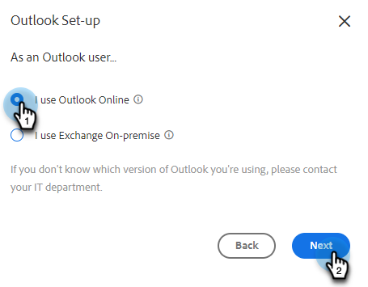
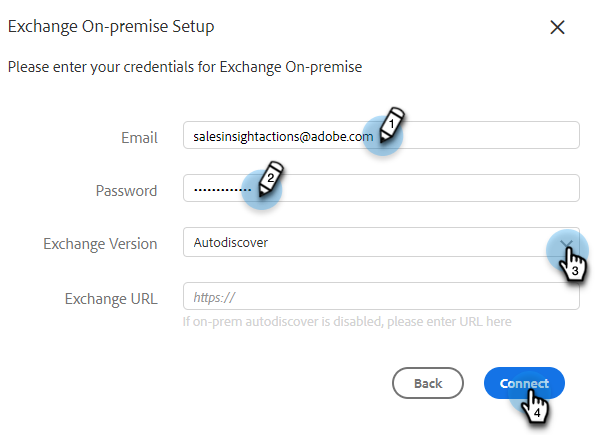

# Se connecter à Outlook {#connect-to-outlook}

Découvrez comment connecter votre compte Sales Insight Actions à Outlook.

>[!NOTE]
>
>Chaque utilisateur doit se connecter à Outlook à partir de son compte commercial Marketo.

## Connexion à Outlook Online {#connecting-to-outlook-online}

La connexion à Outlook signifie que vous recevrez le suivi des réponses, l&#39;accès au canal de diffusion Outlook, la possibilité de planifier des e-mails dans Outlook et d&#39;envoyer des messages conformes.

1. Dans Marketo Sales, cliquez sur l’icône d’engrenage et sélectionnez **Paramètres**.

   

1. Sous Mon compte, sélectionnez **Paramètres de messagerie**.

   

1. Cliquez sur l’onglet **Connexion par e-mail**.

   

1. Cliquez sur **Commencer**.

   

1. Sélectionnez **J&#39;utilise Outlook pour envoyer des e-mails** puis cliquez sur **Suivant**.

   

1. Sélectionnez la version d&#39;Outlook que vous utilisez et cliquez sur **Suivant**. Dans cet exemple, nous choisissons Outlook Online.

   

   <table>
    <tbody>
     <tr>
      <td><strong>Outlook en ligne</strong></td>
      <td>Également appelé Exchange Online</td>
     </tr>
     <tr>
      <td><strong>Exchange On-Premise</strong></td>
      <td>Inclut Exchange 2013 et 2016</td>
     </tr>
    </tbody>
   </table>

   >[!NOTE]
   >
   >Marketo ne prend pas en charge les comptes hybrides Exchange pour le moment.

1. Cliquez sur **OK**.

   

1. Si vous n&#39;êtes pas connecté à Outlook, saisissez vos informations de connexion et cliquez sur **Suivant**. Si vous l’êtes, sélectionnez le compte auquel vous souhaitez vous connecter et cliquez sur **Suivant**. Dans cet exemple, nous sommes déjà connectés.

   

1. Cliquez sur **Accepter**.

   

   Vous pouvez utiliser cette connexion pour effectuer le suivi des e-mails et également comme canal de diffusion.

   >[!NOTE]
   >
   >Outlook Online (Office365) applique ses propres limites d&#39;envoi. [En savoir plus ici](/help/marketo/product-docs/marketo-sales-connect/email/email-delivery/email-connection-throttling.md#email-provider-limits).

## Connexion à Exchange On-Premise {#connecting-to-exchange-on-premise}

La connexion à Exchange On-Premise signifie que vous recevrez le suivi des réponses, l&#39;accès au canal de diffusion Outlook, la possibilité de planifier des e-mails dans Outlook et d&#39;envoyer des messages conformes.

1. Dans Marketo Sales, cliquez sur l’icône d’engrenage et sélectionnez **Paramètres**.

   

1. Sous Mon compte, sélectionnez **Paramètres de messagerie**.

   

1. Cliquez sur l’onglet **Connexion par e-mail**.

   

1. Cliquez sur **Commencer**.

   

1. Sélectionnez **J&#39;utilise Outlook pour envoyer des e-mails** puis cliquez sur **Suivant**.

   

1. Sélectionnez la version d&#39;Outlook que vous utilisez et cliquez sur **Suivant**. Dans cet exemple, nous choisissons Exchange On-premise.

   

   <table>
    <tbody>
     <tr>
      <td><strong>Outlook en ligne</strong></td>
      <td>Également appelé Exchange Online</td>
     </tr>
     <tr>
      <td><strong>Exchange On-Premise</strong></td>
      <td>Inclut Exchange 2013 et 2016</td>
     </tr>
    </tbody>
   </table>

1. Saisissez vos informations d’identification et cliquez sur **Connexion**.

   

   >[!NOTE]
   >
   >Si vous désactivez la découverte automatique dans le menu déroulant Version Exchange, vous devez demander l&#39;URL Exchange à votre service informatique.

   Vous pouvez utiliser cette connexion pour effectuer le suivi des e-mails et également comme canal de diffusion.

   >[!NOTE]
   >
   >Lors de l&#39;utilisation d&#39;Exchange On-Prem, votre équipe informatique établira votre limite d&#39;envoi d&#39;email.

## Obtention de l&#39;autorisation de se connecter à Outlook Online {#getting-permission-to-connect-to-outlook-online}

Vous devrez peut-être travailler avec votre équipe informatique pour obtenir l&#39;autorisation de connecter Marketo Sales à votre compte Outlook Online (Microsoft 365).

>[!NOTE]
>
>Informez l’équipe informatique qui gère votre compte Microsoft 365 que l’application à laquelle vous devez accéder est « Marketo Sales Connect ».

En fonction des préférences et de la configuration actuelle de votre équipe informatique, il est préférable de la consulter pour savoir comment accorder l’accès. Vous trouverez ci-dessous quelques articles qui peuvent vous aider à orienter la conversation.

* Consentement global : [applications intégrées et Azure AD pour les administrateurs Microsoft 365](https://learn.microsoft.com/en-us/microsoft-365/enterprise/integrated-apps-and-azure-ads?view=o365-worldwide){target="_blank"}
* Consentement de l’utilisateur : [configurer la manière dont les utilisateurs consentent aux applications](https://learn.microsoft.com/en-us/azure/active-directory/manage-apps/configure-user-consent?tabs=azure-portal&pivots=portal){target="_blank"}
* Consentement administrateur : [configurer le workflow de consentement administrateur](https://learn.microsoft.com/en-us/microsoft-365/admin/misc/user-consent?source=recommendations&view=o365-worldwide){target="_blank"}
* Activation ou désactivation du consentement utilisateur : [gestion du consentement utilisateur pour les applications dans Microsoft 365](https://learn.microsoft.com/en-us/microsoft-365/admin/misc/user-consent?source=recommendations&view=o365-worldwide){target="_blank"}
* Gestion avec Microsoft Defender : [gestion des applications OAuth](https://learn.microsoft.com/en-us/defender-cloud-apps/manage-app-permissions){target="_blank"}
