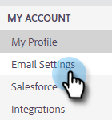

# Vérifier votre e-mail {#verify-your-email}

Si votre identité électronique n’est pas vérifiée, procédez comme suit.

1. Cliquez sur l’icône d’engrenage en haut à droite et sélectionnez **Paramètres**.

   

1. Sous Mon compte, cliquez sur **Paramètres du courrier électronique**.

   

1. Sous Adresse et signature, recherchez l’adresse électronique à vérifier et cliquez sur **Renvoyer le courrier électronique de vérification**. Un nouvel email de vérification sera envoyé.

   

1. Cliquez sur **Renvoyer**.

   

1. Le destinataire ouvre alors l&#39;email et suit les étapes de vérification de l&#39;adresse email.

   

>[!NOTE]
>
>Si vous ne recevez pas l’e-mail de vérification, vérifiez votre dossier de messages indésirables. Si ce n’est pas le cas, contactez le [support Marketo](https://nation.marketo.com/t5/Support/ct-p/Support).
