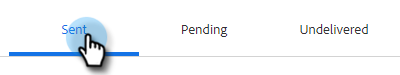

# Aperçu de la recherche avancée {#advanced-search-overview}

En utilisant la recherche avancée pour cibler les prospects qui ont consulté, cliqué ou répondu aux emails, vous pouvez créer une liste ciblée de vos prospects les plus engagés.

## Accès à la recherche avancée {#how-to-access-advanced-search}

1. Dans l’application web, cliquez sur **Centre de commandes**.

   

1. Cliquez sur **Emails**.

   

1. Sélectionnez l’onglet approprié.

   

1. Cliquez sur Recherche avancée.

   

## Filtres {#filters}

**Date**

Sélectionnez la période de votre recherche. Les dates prédéfinies sont mises à jour en fonction de l’état de l’email que vous choisissez (Envoyé, Non livré, En attente).

**Who**

Filtrez par destinataire/expéditeur d’email dans la section Qui .

<table>
 <tr>
  <td><strong>Liste déroulante</strong></td>
  <td><strong>Description</strong></td>
 </tr>
 <tr>
  <td><strong>Afficher comme</strong></td>
  <td>Vous pouvez filtrer par un expéditeur spécifique dans votre instance Sales Connect (cette option est disponible uniquement pour les administrateurs).</td>
 </tr>
 <tr>
  <td><strong>Par groupe</strong></td>
  <td>Filtrez les emails selon un groupe spécifique de destinataires.</td>
 </tr>
 <tr>
  <td><strong>Par individu</strong></td>
  <td>Filtrer par destinataire spécifique.</td>
 </tr>
</table>

**When**

Choisissez par date de création, date de diffusion, date d’échec ou date planifiée. Les options disponibles changent en fonction de l’état de l’email que vous choisissez (Envoyé, Non livré, En attente).

**Campagnes**

Filtrez les emails par participation à une campagne.

**Status**

Vous avez le choix entre trois statuts d&#39;un email. Les options de type/activité changent en fonction de l’état sélectionné.

_**État : Envoyé**_

Filtre par activité d’email envoyée. Vous pouvez choisir des vues/aucun affichage, des clics/aucun clic et/ou des réponses/aucune réponse.

_**État : En attente**_

Filtre par tous les emails en attente.

<table>
 <tr>
  <td><strong>Statut</strong></td>
  <td><strong>Description</strong></td>
 </tr>
 <tr>
  <td><strong>Programmé</strong></td>
  <td>Emails programmés à partir de la fenêtre de composition (Salesforce ou l’application web), des modules externes de messagerie ou d’une campagne.</td>
 </tr>
 <tr>
  <td><strong>Avant-projets</strong></td>
  <td>Courriers électroniques actuellement en état de brouillon. Les emails nécessitent un objet et un destinataire pour être enregistrés en tant que brouillon.</td>
 </tr>
 <tr>
  <td><strong>En cours</strong></td>
  <td>Emails en cours d’envoi. Les emails ne doivent pas rester dans cet état pendant plus de quelques secondes.</td>
 </tr>
</table>

_**État : non livré**_

Filtre les messages par message électronique qui n’ont jamais été remis.

<table>
 <tr>
  <td><strong>Statut</strong></td>
  <td><strong>Description</strong></td>
 </tr>
 <tr>
  <td><strong>Échec</strong></td>
  <td>Lorsqu’un email ne parvient pas à être envoyé à partir de Sales Connect (les raisons courantes sont les emails envoyés aux contacts désabonnés/bloqués, ou si un problème s’est produit lors du remplissage des champs dynamiques).</td>
 </tr>
 <tr>
  <td><strong>Renvoi</strong></td>
  <td>Un email est marqué comme rebonds lorsqu’il est rejeté par le serveur du destinataire. Seuls les emails envoyés par les serveurs Sales Connect s’afficheront ici.</td>
 </tr>
 <tr>
  <td><strong>Spam</strong></td>
  <td>Lorsque l'email a été marqué comme spam (terme courant pour désigner les emails non sollicités) par le destinataire. Seuls les emails envoyés par les serveurs Sales Connect s’afficheront ici.</td>
 </tr>
</table>

## Recherches enregistrées {#saved-searches}

Voici comment créer une recherche enregistrée.

1. Une fois tous vos filtres en place, cliquez sur **Enregistrer les filtres sous**.

   

1. Donnez un nom à votre recherche et cliquez sur **Enregistrer**.

   

Les recherches enregistrées se trouvent dans la barre latérale gauche.

