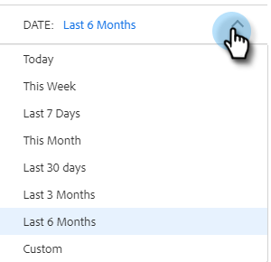

# Vue d’ensemble de la recherche avancée {#advanced-search-overview}

En utilisant la recherche avancée pour cibler les prospects qui ont consulté les e-mails, cliqué sur ceux-ci ou répondu à ceux-ci, vous pouvez créer une liste ciblée de vos prospects les plus engagés.

## Accès à la recherche avancée {#how-to-access-advanced-search}

1. Dans l&#39;application web, cliquez sur **[!UICONTROL Centre de commandes]**.

   

1. Cliquez sur **[!UICONTROL E-mails]**.

   

1. Choisissez l’onglet approprié.

   

1. Cliquez sur [!UICONTROL &#x200B; Recherche avancée &#x200B;].

   

## Filtres {#filters}

**Date**

Choisissez la période de votre recherche. Les dates prédéfinies sont mises à jour en fonction du statut de l’e-mail choisi ([!UICONTROL Envoyé], [!UICONTROL Non diffusé], [!UICONTROL En attente]).

**Qui**

Filtrez par destinataire/expéditeur d’e-mail dans la section [!UICONTROL Qui].

<table>
 <tr>
  <td><strong>Liste déroulante</strong></td>
  <td><strong>Description</strong></td>
 </tr>
 <tr>
  <td><strong>[!UICONTROL View As]</strong></td>
  <td>Filtrez par expéditeur spécifique dans votre instance Sales Connect (cette option est disponible uniquement pour les administrateurs).</td>
 </tr>
 <tr>
  <td><strong>[!UICONTROL By Group]</strong></td>
  <td>Filtrer les e-mails par groupe spécifique de destinataires.</td>
 </tr>
 <tr>
  <td><strong>[!UICONTROL By Person]</strong></td>
  <td>Filtrez par destinataire spécifique.</td>
 </tr>
</table>

**Lorsque**

Choisissez par date de création, date de diffusion, date d’échec ou date planifiée. Les options disponibles changent en fonction du statut de l’e-mail que vous choisissez ([!UICONTROL Envoyé], [!UICONTROL Non diffusé], [!UICONTROL En attente]).

**Campagnes**

Filtrer les emails par participation à la campagne.

**Statut**

Vous avez le choix entre trois statuts d’e-mail. Les options de type/activité changent en fonction du statut sélectionné.

_&#x200B;**Statut : Envoyé**&#x200B;_

Filtre par activité d’e-mail envoyé. Vous pouvez choisir les options [!UICONTROL vues]/[!UICONTROL aucune vue], [!UICONTROL clics]/[!UICONTROL aucun clic] et/ou [!UICONTROL réponses]/[!UICONTROL aucune réponse].

_&#x200B;**Statut : En Attente**&#x200B;_

Filtre par tous les e-mails en attente.

<table>
 <tr>
  <td><strong>Statut</strong></td>
  <td><strong>Description</strong></td>
 </tr>
 <tr>
  <td><strong>[!UICONTROL Scheduled]</strong></td>
  <td>Les e-mails planifiés à partir de la fenêtre de composition (Salesforce ou l’application web), les plug-ins d’e-mail ou une campagne.</td>
 </tr>
 <tr>
  <td><strong>[!UICONTROL Drafts]</strong></td>
  <td>E-mails actuellement à l’état de brouillon. Les e-mails nécessitent une ligne d’objet et un destinataire pour être enregistrés en tant que brouillon.</td>
 </tr>
 <tr>
  <td><strong>[!UICONTROL In Progress]</strong></td>
  <td>E-mails en cours d’envoi. Les e-mails ne doivent pas rester dans cet état pendant plus de quelques secondes.</td>
 </tr>
</table>

_&#x200B;**Statut : non diffusé**&#x200B;_

Filtre par les emails qui n’ont jamais été délivrés.

<table>
 <tr>
  <td><strong>Statut</strong></td>
  <td><strong>Description</strong></td>
 </tr>
 <tr>
  <td><strong>[!UICONTROL Failed]</strong></td>
  <td>Lorsque l’envoi d’un e-mail échoue à partir de Sales Connect (les raisons courantes sont les suivantes : l’envoi d’e-mails à des contacts désabonnés/bloqués ou un problème lors du remplissage des champs dynamiques).</td>
 </tr>
 <tr>
  <td><strong>[!UICONTROL A Rebondi]</strong></td>
  <td>Un e-mail est marqué comme ayant fait l’objet d’un rebond lorsqu’il est rejeté par le serveur du destinataire. Seuls les e-mails envoyés via les serveurs Sales Connect seront affichés ici.</td>
 </tr>
 <tr>
  <td><strong>[!UICONTROL Spam]</strong></td>
  <td>Lorsque l’e-mail a été marqué comme spam (terme courant pour les e-mails non sollicités) par le destinataire. Seuls les e-mails envoyés via les serveurs Sales Connect seront affichés ici.</td>
 </tr>
</table>

## Recherches enregistrées {#saved-searches}

Découvrez comment créer une recherche enregistrée.

1. Une fois tous les filtres en place, cliquez sur **[!UICONTROL Enregistrer les filtres sous]**.

   

1. Attribuez un nom à votre recherche et cliquez sur **[!UICONTROL Enregistrer]**.

   

Vos recherches enregistrées se trouvent dans la barre latérale gauche.

