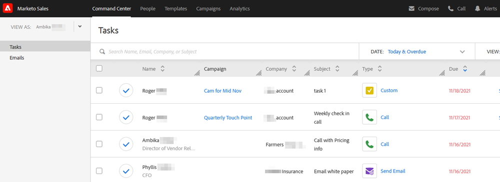

# Présentation du centre de commande {#command-center-overview}

Le [!UICONTROL centre de commande] est une vue unique et unifiée qui vous aide à déterminer l’étape suivante, tout en vous assurant que rien ne passe entre les mailles du filet.

## Gérer les e-mails {#manage-emails}

La section e-mail du [!UICONTROL Centre de commande] vous permet de gérer l’ensemble de votre activité E-mail. Considérez-le comme votre boîte d’envoi d’e-mail pour examiner les e-mails envoyés depuis [!DNL Sales Connect]. Gérez vos e-mails planifiés, vérifiez qui a interagi avec vos e-mails, vérifiez s&#39;il y a eu des problèmes avec vos e-mails en cours de diffusion, etc.

La section e-mail vous donne une vue d&#39;ensemble de tous vos e-mails et simplifie leur organisation avec des onglets principaux et des sous-onglets qui servent de dossiers où vos e-mails sont automatiquement stockés en fonction de leur statut.

<table>
 <tr>
  <th>Principale</th>
  <th>Secondaire</th>
  <th>Description</th>
 </tr>
 <tr>
  <th rowspan="2">[!UICONTROL Sent]</th>
  <td>[!UICONTROL Delivered]</td>
  <td>E-mails ayant été envoyés au destinataire.</td>
 </tr>
 <tr>
  <td>[!UICONTROL Archivé]</td>
  <td>Les emails archivés par l’utilisateur afin de désactiver le tracking sur les emails.</td>
 </tr>
 <tr>
  <th rowspan="3">[!UICONTROL Pending]</th>
  <td>[!UICONTROL Scheduled]</td>
  <td>E-mails dont la diffusion est actuellement planifiée. Une fois qu’un e-mail est envoyé, il est déplacé vers le dossier diffusé.</td>
 </tr>
 <tr>
  <td>[!UICONTROL Draft]</td>
  <td>E-mails enregistrés en tant que brouillon. 
  <strong>Remarque </strong> : seuls des e-mails uniques peuvent être enregistrés en tant que brouillons. Les e-mails en masse (sélectionner et envoyer des e-mails et regrouper des e-mails) ne seront pas enregistrés en tant que brouillons.</td>
 </tr>
 <tr>
  <td>[!UICONTROL In] En Cours</td>
  <td>Il s’agit d’un état intermédiaire dans lequel les e-mails entrent lorsqu’ils se trouvent dans le mouvement d’envoi. Les e-mails ne doivent être en cours que pendant quelques instants.</td>
 </tr>
 <tr>
  <th rowspan="3">[!UICONTROL Non Diffusé]</th>
  <td>[!UICONTROL Failed]</td>
  <td>E-mails dont la diffusion a échoué.
</td>
 </tr>
 <tr>
  <td>[!UICONTROL A Rebondi]</td>
  <td>E-mails rejetés par le serveur de messagerie des destinataires. 
  <strong>Remarque </strong> : cela n’est détecté que si vous êtes un ancien utilisateur de ToutApp et que vous avez accès aux serveurs MSC en tant que canal de diffusion.</td>
 </tr>
 <tr>
  <td>[!UICONTROL Spam]</td>
  <td>E-mails ayant été manuellement marqués comme spam par le destinataire. 
  <strong>Remarque </strong> : cela n’est détecté que si vous êtes un ancien utilisateur de ToutApp et que vous avez accès aux serveurs MSC en tant que canal de diffusion.</td>
 </tr>
</table>

## Gérer les tâches {#manage-tasks}

La section des tâches est votre guichet unique pour la gestion et l’exécution des tâches. Vous pouvez y gérer vos tâches en toute simplicité pour accroître votre productivité et rester concentré sur les éléments les plus pertinents.

## Suivi auprès des prospects engagés {#follow-up-with-engaged-prospects}

Une fois que vous avez commencé à interagir avec vos prospects via la fenêtre de composition ou les campagnes, vous pouvez commencer à cibler à nouveau les prospects les plus engagés à l’aide de la fonctionnalité de recherche avancée.

Par exemple, si vous ajoutez 100 personnes à une campagne dans MSC, vous pouvez cibler à nouveau les personnes qui ont consulté et cliqué sur votre e-mail, mais qui n’y ont pas répondu. Pour ce faire, vous pouvez utiliser le filtre Campagne avec les filtres d’activité Afficher et Cliquer sur le statut pour identifier une liste de personnes à cibler à nouveau.

Bonus : si vous enregistrez votre recherche avancée, elle fonctionnera en tant que liste dynamique et ajoutera les e-mails qui répondent aux critères d’engagement une fois que le destinataire aura affiché ou cliqué sur votre e-mail.

>[!MORELIKETHIS]
>
>* Tâches
>* Vue d’ensemble de la recherche avancée
>* Composition d’e-mails en bloc avec sélection et envoi
